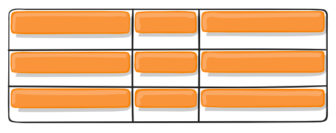

# CSS Grid 网格布局教程 - 阮一峰的网络日志

## Excerpt

网格布局（Grid）是最强大的 CSS 布局方案。

## 属性速查

| 容器属性                             | 说明                                                                                                                                                | 示例                                        |
| -------------------------------- | ------------------------------------------------------------------------------------------------------------------------------------------------- | ----------------------------------------- |
| `display: grid;`                 | 将容器设置为块级元素                                                                                                                                        |                                           |
| `display: inline-grid;`          | 将容器设置为行内元素                                                                                                                                        |                                           |
| `grid-template-columns`          | 定义每一列的列宽                                                                                                                                          | grid-template-columns: repeat(3, 33.33%); |
| `grid-template-rows`             | 定义每一行的行高     | grid-template-rows: 100px 33.33% 33.33%;  |
| ~~grid-row-gap~~ `row-gap`       | 设置行与行的间隔（行间距）|                                           |
| ~~grid-column-gap~~ `column-gap` | 设置列与列的间隔（列间 距）|                                           |
| ~~grid-gap~~ `gap`               | `row-gap` 与列 `column-gap` 的合并简写形式                                                                                                                    | grid-gap: 20px 20px;                      |
| `grid-template-areas`            | 定义区域                  |                                           |
| `grid-auto-flow`                 | 元素放置顺序，默认是 `row`（|                                           |
| `justify-items`                  | 设置单元格内容的水平位置（左中右）|                                           |
| `align-items`                    | 设置单元格内容的垂直位置（上中 下）|                                           |
| `place-items`                    | `justify-items` 和 `alig|                                           |
| `justify-content`                | 整个内容区域在容器里面的水平位置（左中右）|                                           |
| `align-content`                  | 整个内容区域在容器里面的垂直位 置（上 中下）                                                                                                                              |                                           |
| `place-content`                  | `align-content`属性和`justify-content`属性的合并简写形式                                                                                                      |                                           |
| `grid-auto-columns`              | 设置浏览器自动创建的多余网格的列宽                                                                                                                                 |                                           |
| `grid-auto-rows`                 | 设置浏览器自动创建的多余网格的行高                                                                                                                                   |                                           |
| `grid-template`                  | `grid-template-columns`、`grid-template-rows`和<br />`grid-template-areas`这个属性的合并简写形式                                                               |                                           |
| `grid`                           | `grid-template-rows`、`grid-template-columns`、<br />`grid-template-areas`、 `grid-auto-rows`、<br />`grid-auto-columns`、`grid-auto-flow`这六个属性的合并简写形式 |                                           |

| 项目属性                | 说明                                                                                                       | 示例                                       |
| ------------------- | -------------------------------------------------------------------------------------------------------- | ---------------------------------------- |
| `grid-column-start` | 左边框所在的垂直网格线                                                                                              | grid-column-start: 2;//指定项目的左边框是第二根垂直网格线 |
| `grid-column-end`   | 右边框所在的垂直网格线                                                                                              |                                          |
| `grid-row-start`    | 上边框所在的水平网格线                                                                                              |                                          |
| `grid-row-end`      | 下边框所在的水平网格线                                                                                                 |                                          |
| `grid-column`       | `grid-column-sta rt` 和 `grid-column-end` 的合 并简写形式                                                             |                                          |
| `grid-row`          | `grid-row-start` 属性和<br />`grid-row-end` 的合并简写形式                                                            |                                          |
| `grid-area`         | 指定项目放在哪一个区域，也可作为<br />`gr id-row-start`、` grid-column-start`、<br />`grid-row-end`、`grid-column-end` 的合并简写形式 |                                          |
| `justify-self`      | 设置单元格内容的水平位置（左中右），<br />跟 `justify-item s` 属性的用法完全一致，但只作用于单个项目                                              |                                          |
| `align-self`        | 设置单元格内容的垂直位置（上中 下），<br />跟 `ali gn-items` 属性的用法完全一致，也是只作用于单个项目                                               |                                          |
| `place-self`        | `align-self` 属性和 `justify-self` 属性的合并简写形式                                                                   |                                          |

## 一、概述

网格布局（Grid）是最强大的 CSS 布局方案。

它将网页划分成一个个网格，可以任意组合不同的网格，做出各种各样的布局。以前，只能通过复杂的 CSS 框架达到的效果，现在浏览器内置了。


上图这样的布局，就是 Grid 布局的拿手好戏。

Grid 布局与 [Flex 布局](https://www.ruanyifeng.com/blog/2015/07/flex-grammar.html ) 有一定的相似性，都可以指定容器内部多个项目的位置。但是，它们也存在重大区别。

Flex 布局是轴线布局，只能指 定 "项 目 "针对轴线的位置，可以看作是**一维布局**。Grid 布局则是将容器划分 成 " 行 " 和 " 列 "，产生单元格，然后指 定 "项目所 在 "的单元格，可以看作是**二维布局**。Grid 布局远比 Flex 布局强大。

## 二、基本概念

学习 Grid 布局之前，需要了解一些基本概念。

### 2.1 容器和项目

采用网格布局的区域，称 为 "容 器 "（container）。容器内部采用网格定位的子元素，称 为 "项 目 "（item）。

 ```html
 <div>
   <div><p>1</p></div>
   <div><p>2</p></div>
   <div><p>3</p></div>
 </div>

 ```

上面代码中，最外层的 `< div>` 元素就是容器，内层的三个 `< div>` 元素就是项目。

注意：项目只能是容器的顶层子元素，不包含项目的子元素，比如上面代码 的 `<p> ` 元素就不是项目。Grid 布局只对项目生效。

### 2.2 行和列

容器里面的水平区域称 为 " 行 "（row），垂直区域称 为 " 列 "（column）。


上图中，水平的深色区域就 是 " 行 "，垂直的深色区域就 是 " 列 "。

### 2.3 单元格

行和列的交叉区域，称 为 "单元 格 "（cell）。

正常情况下，`n ` 行 和 `m ` 列会产 生 `n x m ` 个单元格。比如，3 行 3列会产 生 9个单元格。

### 2.4 网格线

划分网格的线，称 为 "网格 线 "（grid line）。水平网格线划分出行，垂直网格线划分出列。

正常情况下，`n ` 行 有 `n + 1 ` 根水平网格线，`m ` 列 有 `m + 1 ` 根垂直网格线，比如三行就有四根水平网格线。


上图是一个 4 x 4 的网格，共 有 5根水平网格线 和 5根垂直网格线。

## 三、容器属性

Grid 布局的属性分成两类。一类定义在容器上面，称为容器属性；另一类定义在项目上面，称为项目属性。这部分先介绍容器属性。

### 3.1 display 属性

`display: grid ` 指定一个容器采用网格布局。

```css
div {
  display: grid;
}

```


上图 是 `display: grid ` 的 [效果](https://jsbin.com/guvivum/edit?html,css,output)。

默认情况下，容器元素都是块级元素，但也可以设成行内元素。

```css
div {
  display: inline-grid;
}

```

上面 代码指定 ` div` 是一个行内元素，该元素内部采用网格布局。


上图 是 `display: inline-grid ` 的 [效果](https://jsbin.com/qatitav/edit?html,css,output)。

注意，设为网格布局以后，容器子元素（项目）的 `float`、`display: inline-block`、`display: table-cell`、`vertical-align ` 和 `column-* ` 等设置都将失效。

### 3.2 grid-template-columns、grid-template-rows

grid-template-columns 属性，

grid-template-rows 属性

容器指定了网格布局以后，接着就要划分行和列。`grid-template-columns ` 属性定义每一列的列宽，`grid-template-rows ` 属性定义每一行的行高。

```css
.container {
  display: grid;
  grid-template-columns: 100px 100px 100px;
  grid-template-rows: 100px 100px 100px;
}

```

[上面代码](https://jsbin.com/qiginur/edit?css,out put)指定了一个三行三列的网格，列宽和 行高都是 `100px`。


除了使用绝对单位，也可以使用百分比。

```css
.container {
  display: grid;
  grid-template-columns: 33.33% 33.33% 33.33%;
  grid-template-rows: 33.33% 33.33% 33.33%;
}

```

### **（1）repeat()**

有时候，重复写同样的值非常麻烦，尤其网格很多时。这时，可以使 用 `repeat() ` 函数，简化重复的值。上面的代码 用 `repeat() ` 改写如下。

```css
.container {
  display: grid;
  grid-template-columns: repeat(3, 33.33%);
  grid-template-rows: repeat(3, 33.33%);
}

```

`repea t()` 接受两个参数，第一个参数是重复的次数（上例是 3），第二个参数是所要重复的值。

`repeat() ` 重复某种模式也是可以的。

```css
grid-template-columns: repeat(2, 100px 20px 80px);

```

[上面代码](https://jsbin.com/cokohu/edit?css,out put ) 定义了 6列，第一列和第四列 的宽度为 `100px`，第二列和 第五列为 `20px`，第三列和 第六列为 `80px`。


### **（2）auto-fill 关键字**

有时，单元格的大小是固定的，但是容器的大小不确定。如果希望每一行（或每一列）容纳尽可能多的单元格，这时可以使 用 `auto-fill ` 关键字表示自动填充。

```css
.container {
  display: grid;
  grid-template-columns: repeat(auto-fill, 100px);
}

```

[上面代码](https://jsbin.com/himoku/edit?css,out put)表示 每列宽度 `100px`，然后自动填充，直到容器不能放置更多的列。


### **（3）fr 关键字**

为了方便表示比例关系，网格布局提供 了 `fr ` 关键字（fraction 的缩写，意 为 "片 段 "）。如果两列的宽度分别 为 `1fr ` 和 `2fr`，就表示后者是前者的两倍。

```css
.container {
  display: grid;
  grid-template-columns: 1fr 1fr;
}

```

[上面代码](https://jsbin.com/hadexek/edit?html,css,out put)表示两个相同宽度的列。


`fr ` 可以与绝对长度的单位结合使用，这时会非常方便。

```css
.container {
  display: grid;
  grid-template-columns: 150px 1fr 2fr;
}

```

[上面代码](https://jsbin.com/remowec/edit?html,css,out put)表示，第一列 的宽度 为 150像素，第二列的宽度是第三列的一半。


### **（4）minmax()**

`minmax() ` 函数产生一个长度范围，表示长度就在这个范围之中。它接受两个参数，分别为最小值和最大值。

```css
grid-template-columns: 1fr 1fr minmax(100px, 1fr);

```

上面代码中，`minmax(100px, 1 fr)` 表示列 宽不小于 `100px`，不大于 `1fr`。

### **（5）auto 关键字**

`auto ` 关键字表示由浏览器自己决定长度。

```css
grid-template-columns: 100px auto 100px;

```

上面代码中，第二列的宽度，基本上等于该列单元格的最大宽度，除非单元格内 容设置了 `min-width`，且这个值大于最大宽度。

### **（6）网格线的名称**

`grid-template-columns ` 属性 和 `grid-template-rows ` 属性里面，还可以使用方括号，指定每一根网格线的名字，方便以后的引用。

```
.container {
  display: grid;
  grid-template-columns: [c1] 100px [c2] 100px [c3] auto [c4];
  grid-template-rows: [r1] 100px [r2] 100px [r3] auto [r4];
}

```

上面代码指定网 格 布局为 3行 x 3列，因此有 4根垂直 网 格线和 4根水平网格线。方括号里面依次是这八根线的名字。

网格布局允许同一根线有多个名字，比 如 `[fifth-line row-5]`。

### **（7）布局实例**

`grid-template-columns ` 属性对于网页布局非常有用。两栏式布局只需要一行代码。

```css
.wrapper {
  display: grid;
  grid-template-columns: 70% 30%;
}

```

上面代码将左 边栏设为 70%，右 边栏设为 30%。

传统的十二网格布局，写起来也很容易。

```css
grid-template-columns: repeat(12, 1fr);

```

### 3.3 grid-row-gap、grid-column-gap、grid-gap

grid-row-gap 属性，

grid-column-gap 属性，

grid-gap 属性

`grid-row-gap ` 属性设置行与行的间隔（行间距），`grid-column-gap ` 属性设置列与列的间隔（列间距）。

```css
.container {
  grid-row-gap: 20px;
  grid-column-gap: 20px;
}

```

[上面代码](https://jsbin.com/mezufab/edit?css,out put)中，`grid-row- gap` 用于设置行间距，`grid-column- gap` 用于设置列间距。


`grid-gap ` 属性 是 `grid-column-gap ` 和 `grid-row-gap ` 的合并简写形式，语法如下。

```css
grid-gap: <grid-row-gap> <grid-column-gap>;

```

因此，上面一段 CSS 代码等同于下面的代码。

```css
.container {
  grid-gap: 20px 20px;
}

`` `
如果`grid- gap`省略了第二个值，浏览器认为第二个值等于第一个值。

根据最新标准，上面三个属性名 的`grid- `前缀已经删除，`grid-column-gap ` 和`grid-row-gap `写 成`column-gap ` 和`row-gap`，`grid-gap `写 成`gap`。

### 3.4 grid-template-areas 属性

网格布局允许指 定 "区 域"（area），一个区域由单个或多个单元格组成。`grid-template-areas `属性用于定义区域。

```css
.container {
  display: grid;
  grid-template-columns: 100px 100px 100px;
  grid-template-rows: 100px 100px 100px;
  grid-template-areas: 'a b c'
                       'd e f'
                       'g h i';
}

```

上面代码 先 划分出 9个单元格，然后将 其定名 为 `a` 到 `i` 的九个区域，分别对应这九个单元格。

多个单元格合并成一个区域的写法如下。

```css
grid-template-areas: 'a a a'
                     'b b b'
                     'c c c';

```

上 面 代码将 9个单 元格分成 `a`、`b`、`c` 三个区域。

下面是一个布局实例。

```css
grid-template-areas: "header header header"
                     "main main sidebar"
                     "footer footer footer";

```

上面代码中，顶部是 页眉区域 `header`，底部是 页脚区域 `footer`，中间 部分则为 `m a in` 和 `sidebar`。

如果某些区域不需要利用，则使 用 " 点 "（`.`）表示。

```css
grid-template-areas: 'a . c'
                     'd . f'
                     'g . i';

```

上面代码中，中间一列为点，表示没有用到该单元格，或者该单元格不属于任何区域。

注意，区域的命名会影响到网格线。每个区域的起始网格线，会自动命名 为 `区域名-start`，终止网格线自动命名 为 `区域名-end`。

比如，区域名 为 `header`，则起始位置的水平网格线和垂直网格线叫 做 `header-start`，终止位置的水平网格线和垂直网格线叫 做 `header-end`。

### 3.5 grid-auto-flow 属性

划分网格以后，容器的子元素会按照顺序，自动放置在每一个网格。默认的放置顺序 是 "先行后 列 "，即先填满第一行，再开始放入第二行，即下图数字的顺序。


这个顺序 由 `grid-auto-flow ` 属性决定，默认值 是 `row`，即 "先行后 列 "。也可以将它设 成 `column`，变 成 "先列后 行 "。

```
gri
d-auto-flow: column;
```

[上面代码](https://jsbin.com/xutokec/edit?css,out put )设置了 `col umn` 以后，放置顺序就变成了下图。


`grid-auto-flow ` 属性除了设置 成 `row ` 和 `column`，还可以设 成 `row dense ` 和 `column dense`。这两个值主要用于，某些项目指定位置以后，剩下的项目怎么自动放置。

[下面的例子](https://jsbin.com/wapejok/edit?css,output ) 让 1号项目 和 2号项目各占据两个单元格，然后在默认 的 `grid-auto-flow: row ` 情况下，会产生下面这样的布局。


上图中，1号项目后面的位置是空的，这是因 为 3号项目默认跟 着 2号项目，所以会排 在 2号项目后面。

现在修改设置，设 为 `row dense`，表 示 "先行后 列 "，并且尽可能紧密填满，尽量不出现空格。

```css
grid-auto-flow: row dense;

```

[上面代码](https://jsbin.com/helewuy/edit?css,out put)的效果如下。


上图会先填满第一行，再填满第二行，所 以 3号项目就会紧跟 在 1号项目的后面。8号项目 和 9号项目就会排到第四行。

如果将设置改 为 `column dense`，表 示 "先列后 行 "，并且尽量填满空格。

```css
gri
d-auto-flow: column dense;
```

[上面代码](https://jsbin.com/pupoduc/1/edit?html,css,out put)的效果如下。


上图会先填满第一列，再填满 第 2列，所 以 3号项目在第一列，4号项目在第二列。8号项目 和 9号项目被挤到了第四列。

### 3.6 justify-items、align-items、place-items

justify-items 属性，

align-items 属性，

place-items 属性

`justify-items ` 属性设置单元格内容的水平位置（左中右），`align-items ` 属性设置单元格内容的垂直位置（上中下）。

```css
.container {
  justify-items: start | end | center | stretch;
  align-items: start | end | center | stretch;
}

```

这两个属性的写法完全相同，都可以取下面这些值。

- start：对齐单元格的起始边缘。
- end：对齐单元格的结束边缘。
- center：单元格内部居中。
- stretch：拉伸，占满单元格的整个宽度（默认值）。

```css
.container {
  justify-items: start;
}

```

[上面代码](https://jsbin.com/gijeqej/edit?css,out put)表示，单元格的内容左对齐，效果如下图。


```css
.container {
  align-items: start;
}

```

[上面代码](https://jsbin.com/tecawur/edit?css,out put)表示，单元格的内容头部对齐，效果如下图。



`place-items ` 属性 是 `align-items ` 属性 和 `justify-items ` 属性的合并简写形式。

```css
place-items: <align-items> <justify-items>;

```

下面是一个例子。

```css
place-items: start end;

```

如果省略第二个值，则浏览器认为与第一个值相等。

### 3.7 justify-content、align-content、place-content

justify-content 属性，

align-content 属性，

place-content 属性

`justify-content ` 属性是整个内容区域在容器里面的水平位置（左中右），`align-content ` 属性是整个内容区域的垂直位置（上中下）。

```css
.container {
  justify-content: start | end | center | stretch | space-around | space-between | space-evenly;
  align-content: start | end | center | stretch | space-around | space-between | space-evenly;
}

```

这两个属性的写法完全相同，都可以取下面这些值。（下面 的图都以 `justify-cont ent` 属性为例，`align-cont ent` 属性的图完全一样，只是将水平方向改成垂直方向。）

  start - 对齐容器的起始边框。


  end - 对齐容器的结束边框。


  center - 容器内部居中。


  stretch - 项目大小没有指定时，拉伸占据整个网格容器。


  space-around - 每个项目两侧的间隔相等。所以，项目之间的间隔比项目与容器边框的间隔大一倍。


  space-between - 项目与项目的间隔相等，项目与容器边框之间没有间隔。


  space-evenly - 项目与项目的间隔相等，项目与容器边框之间也是同样长度的间隔。


`place-content ` 属性 是 `align-content ` 属性 和 `justify-content ` 属性的合并简写形式。

```css
place-content: <align-content<justify-content>

```

下面是一个例子。

```css
place-content: space-around space-evenly;

```

如果省略第二个值，浏览器就会假定第二个值等于第一个值。

### 3.8 grid-auto-columns、grid-auto-rows

grid-auto-columns 属性，

grid-auto-rows 属性

有时候，一些项目的指定位置，在现有网格的外部。比如网格只 有 3列，但是某一个项目指定在 第 5行。这时，浏览器会自动生成多余的网格，以便放置项目。

`grid-auto-columns ` 属性 和 `grid-auto-rows ` 属性用来设置，浏览器自动创建的多余网格的列宽和行高。它们的写法 与 `grid-template-columns ` 和 `grid-template-rows ` 完全相同。如果不指定这两个属性，浏览器完全根据单元格内容的大小，决定新增网格的列宽和行高。

[下面的例子](https://jsbin.com/sayuric/edit?css,output ) 里面，划分好的网格 是 3行 x  3列，但是，8号项目指定在 第 4行，9号项目指定在 第 5行。

```css
.container {
  display: grid;
  grid-template-columns: 100px 100px 100px;
  grid-template-rows: 100px 100px 100px;
  grid-auto-rows: 50px;
}

```

上面代码指定新增的行 高统一为 50px（原始 的行高为 100px）。


### 3.9 grid-template、grid

grid-template 属性，

grid 属性

`grid-template ` 属性 是 `grid-template-columns`、`grid-template-rows ` 和 `grid-template-areas ` 这三个属性的合并简写形式。

`grid ` 属性 是 `grid-template-rows`、`grid-template-columns`、`grid-template-areas` `grid-auto-rows`、`grid-auto-columns`、`grid-auto-flow ` 这六个属性的合并简写形式。

从易读易写的角度考虑，还是建议不要合并属性，所以这里就不详细介绍这两个属性了。

## 四、项目属性

下面这些属性定义在项目上面。

### 4.1 grid-column-start、grid-column-end、grid-row-start、grid-row-end

grid-column-start 属性，

grid-column-end 属性，

grid-row-start 属性，

grid-row-end 属性

项目的位置是可以指定的，具体方法就是指定项目的四个边框，分别定位在哪根网格线。

- rid-column-start  ` 属性：左边框所在的垂直网格线
- `grid-column-end ` 属性：右边框所在的垂直网格线
- `grid-row-star t` 属性：上边框所在的水平网格线
- `grid-row-end` 属性：下边框所在的水平网格线

```css
.item-1 {
  grid-column-start: 2;
  grid-column-end: 4;
}

```

[上面代码](https://jsbin.com/yukobuf/edit?css,out put) 指定，1 号项目的左边框是第二根垂直网格线，右边框是第四根垂直网格线。


上图中，只指定 了 1 号项目的左右边框，没有指定上下边框，所以会采用默认位置，即上边框是第一根水平网格线，下边框是第二根水平网格线。

除 了 1 号项目以外，其他项目都没有指定位置，由浏览器自动布局，这时它们的位置由容器 的 `grid-auto-flow ` 属性决定，这个属性的默认值 是 `row`，因此 会 " 先行后 列 " 进行排列。读者可以把这个属性的值分别改 成 `column`、`row dense ` 和 `column dense`，看看其他项目的位置发生了怎样的变化。

[下面的例子](https://jsbin.com/nagobey/edit?html,css,output ) 是指定四个边框位置的效果。

```css
.item-1 {
  grid-column-start: 1;
  grid-column-end: 3;
  grid-row-start: 2;
  grid-row-end: 4;
}

```


这四个属性的值，除了指定为第几个网格线，还可以指定为网格线的名字。

```css
.item-1 {
  grid-column-start: header-start;
  grid-column-end: header-end;
}

```

上面代码中，左边框和右边框的位置，都指定为网格线的名字。

这四个属性的值还可以使 用 `span ` 关键字，表 示 " 跨 越 "，即左右边框（上下边框）之间跨越多少个网格。

```css
.item-1 {
  grid-column-start: span 2;
}

```

[上面代码](https://jsbin.com/hehumay/edit?html,css,out put) 表示，1 号项目的左边框距离右 边 框跨越 2 个网格。


这 与 [下面的代码](https://jsbin.com/mujihib/edit?html,css,output ) 效果完全一样。

```css
.item-1 {
  grid-column-end: span 2;
}

```

使用这四个属性，如果产生了项目的重叠，则使用 `z-in dex` 属性指定项目的重叠顺序。

### 4.2 grid-column、grid-row

grid-column 属性，

grid-row 属性

`grid-column ` 属性 是 `grid-column-start ` 和 `grid-column-end ` 的合并简写形式，`grid-row ` 属性 是 `grid-row-start ` 属性 和 `grid-row-end ` 的合并简写形式。

```css
.item {
  grid-column: <start-line> / <end-line>;
  grid-row: <start-line> / <end-line>;
}

```

下面是一个例子。

```css
.item-1 {
  grid-column: 1 / 3;
  grid-row: 1 / 2;
}
/* 等同于 */
.item-1 {
  grid-column-start: 1;
  grid-column-end: 3;
  grid-row-start: 1;
  grid-row-end: 2;
}

```

上面代码 中，项目 `ite m-1` 占据第一行，从第一根列线到第三根列线。

这两个属性之中，也可以使 用 `span ` 关键字，表示跨越多少个网格。

```css
.item-1 {
  background: #b03532;
  grid-column: 1 / 3;
  grid-row: 1 / 3;
}
/* 等同于 */
.item-1 {
  background: #b03532;
  grid-column: 1 / span 2;
  grid-row: 1 / span 2;
}

```

[上面代码](https://jsbin.com/volugow/edit?html,css,out put) 中，项目 `ite m-1` 占据的区域，包括第一行 + 第二行、第一列 + 第二列。


斜杠以及后面的部分可以省略，默认跨越一个网格。

```css
.item-1 {
  grid-column: 1;
  grid-row: 1;
}

```

上面代码 中，项目 `ite m-1` 占据左上角第一个网格。

### 4.3 grid-area 属性

`grid-area ` 属性指定项目放在哪一个区域。

```
.item-1 {
  grid-area: e;
}

```

[上面代码](https://jsbin.com/qokexob/edit?css,out put ) 中，1 号 项目位 于 `e` 区域，效果如下图。


`grid-area ` 属性还可用 作 `grid-row-start`、`grid-column-start`、`grid-row-end`、`grid-column-end ` 的合并简写形式，直接指定项目的位置。

```css
.item {
  grid-area: <row-start> / <column-start> / <row-end> / <column-end>;
}

```

下 面是一个 [例子](https://jsbin.com/duyafez/edit?css,output)。

```css
.item-1 {
  grid-area: 1 / 1 / 3 / 3;
}

```

### 4.4 justify-self、align-self、place-self

justify-self 属性，

align-self 属性，

place-self 属性

`justify-self ` 属性设置单元格内容的水平位置（左中右），跟 `justify-items ` 属性的用法完全一致，但只作用于单个项目。

`align-self ` 属性设置单元格内容的垂直位置（上中下），跟 `align-items ` 属性的用法完全一致，也是只作用于单个项目。

```css
.item {
  justify-self: start | end | center | stretch;
  align-self: start | end | center | stretch;
}

```

这两个属性都可以取下面四个值。

- art：对齐单元格的起始边缘。
- end：对齐单元格的结束边缘。
- center：单元格内部居中。
- stretch：拉伸，占满单元格的整个宽度（默认值）。

下面 是 `justify-self: start ` 的例子。

```css
.item-1  {
  justify-self: start;
}

```


`place-self ` 属性 是 `align-self ` 属性 和 `justify-self ` 属性的合并简写形式。

```css
place-self: <align-self<justify-self>;

```

下面是一个例子。

```css
place-self: center center;

```

如果省略第二个值，`place-s elf` 属性会认为这两个值相等。

## 五、参考链接

   Complete Guide to Grid](assets/476663aaade668a45882934d0eb5c085_MD5.unknown), by Chris House

- [Understanding the CSS Grid Layout Module](https://webdesign.tutsplus.com/series/understanding-the-css-grid-layout-module--cms-1079), by Ian Yates
- [How to Build an Off-Canvas Navigation With CSS Grid](https://webdesign.tutsplus.com/tutorials/how-to-build-an-off-canvas-navigation-with-css-grid--cms-28191), Ian Yates
- [Introduction to the CSS Grid Layout With Examples](https://code.tutsplus.com/tutorials/introduction-to-css-grid-layout-with-examples--cms-25392), Dogacan Bilgili
- [Learn CSS Grid](http://learncssgrid.com/), Jonathan Suh
- [How I stopped using Bootstrap's layout thanks to CSS Grid](https://blog.theodo.fr/2018/03/stop-using-bootstrap-layout-thanks-to-css-grid/), Cédric Kui

（完）
