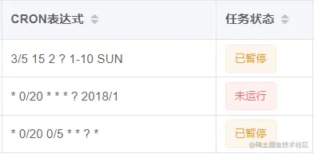
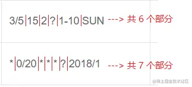
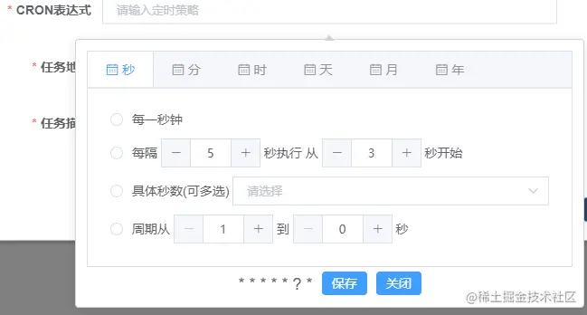

# 前端定时任务：CRON表达式的生成和转化(记录插件使用) - 掘金

## 前言

在公司项目中，让我做一个定时任务的页面，也就涉及到CRON表达式，但是我从来没写过这个东西，也不知道CRON表达式是什么。简单的去了解了一下，发现如果自己手写的话，会非常麻烦，代码量还是比较大，而且网上现有的个别代码模板，在表达式比较复杂的时候，容易出错。所以最后还是决定找个插件来用。

## 什么是 CRON 表达式

**CRON 表达式** 就是 **由若干数字、空格、符号按一定的规则，组成的一组字符串，用来表达时间的信息**，类似于正则表达式

> **举个栗子**：  
> 比如我们有一个每天凌晨12:00更新系统数据的任务，那么我们不可能每天都人工的等在电脑前，手动的去卡着凌晨12:00点更新系统吧。所以这时候，我们就可以使用 CRON 表达式，让它去帮我们控制时间，到了凌晨12:00的时候自动执行系统更新任务。

### CRON 表达式的格式

先看一张图：



可以看见，上述表格中的 **CRON 表达式**，被空格分成了 6 或 7 个部分，用图画一下，看的更清楚



每一个部分，代表一个含义，对应起来就是 **“秒 分 时 日 月 星期”** 和 **“秒 分 时 日 月 星期 年”**

> 一般情况下，我们是不写“年”的，因为基本不会遇到让某个任务每隔几年执行一次 或是 规定任务从哪一年开始执行的需求，所以一般我们可以忽略 “年”，不写“年”，当然你写上也是没有问题的

本篇文章主要是记录我的插件使用，所以这里我就不做表达式的取值说明了，具体的取值说明，可以去网上搜索了解一下，比如这篇 [Cron表达式的详细用法](https://link.juejin.cn/?target=https%3A%2F%2Fwww.jianshu.com%2Fp%2Fe9ce1a7e1ed1 "https://www.jianshu.com/p/e9ce1a7e1ed1")

## CRON 表达式的生成插件 —— vue-cron

这是一个cron表达式生成插件,基于vue与element-ui实现  
插件地址：[vue-cron-npm (npmjs.com)](https://link.juejin.cn/?target=https%3A%2F%2Fwww.npmjs.com%2Fpackage%2Fvue-cron%2Fv%2F1.0.9 "https://www.npmjs.com/package/vue-cron/v/1.0.9")

### 安装

```
npm install --save vue-cron

复制代码
```

### 引入

```
// 前置配置
import Vue from 'vue'
import ElementUI from 'element-ui';
import 'element-ui/lib/theme-chalk/index.css'
Vue.use(ElementUI);
 
// 在 main.js 文件里全局引入 
import VueCron from 'vue-cron'
Vue.use(VueCron);  // 使用方式：<vueCron></vueCron>
 
// 在相关页面文件里局部引入
import {cron} from 'vue-cron' // 使用方式：<cron></cron>

export default {
    template: '<cron/>',
    components: { cron }
}

复制代码
```

### demo

```
// html
<el-popover v-model="cronPopover">
    <cron @change="onChangeCron" @close="cronPopover = false"></cron>
        <el-input
            slot="reference"
            @click="cronPopover = true"
            v-model="formData.cronExpression"
            placeholder="请输入定时策略"
            size="small"
        ></el-input>
</el-popover>

// 定义变量
export default {
  components: { cron },
  data() {
    return {
      cronPopover: false,
      cron: "",
      formData: {
        cronExpression: "",
      },
    };
  }
}

// js
 methods: {
    // 当corn表达式的值发生变化变化时触发,参数是cron表达式的值
    onChangeCron(v) {
      this.formData.cronExpression = v;
    },
 }
复制代码
```

### 效果图



## CRON 表达式的转化插件 —— cronstrue

**cronstrue** 是一个 JavaScript 库，它解析 cron 表达式并输出人类可读的 cron 调度描述。例如，给定表达式`*/5 * * * *`，它将输出`每5分钟`。  
插件地址：[GitHub - bradymholt/cRonstrue](https://link.juejin.cn/?target=https%3A%2F%2Fgithub.com%2Fbradymholt%2FcRonstrue "https://github.com/bradymholt/cRonstrue")

### 安装

```
npm install --save cronstrue

// 安装有几种方式，我这里就使用最常用的
复制代码
```

### 引入

```
import cronstrue from "cronstrue/i18n"; 

// 一定别写漏这个 "/i18n"，我开始就是写漏了，结果转化语言的时候就不成功
复制代码
```

### 使用

```
cronstrue.toString("* 0/20 0/5 * * ? *",{ locale: "zh_CN" });

// 结果就是：每秒, 每隔 20 分钟, 每隔 5 小时
复制代码
```

> 一定要记得配置 `locale`，使用中文或者其他语言转化，我这里是使用的简体中文。具体还可以转化为哪些语言，请点击 [插件地址](https://link.juejin.cn/?target=https%3A%2F%2Fgithub.com%2Fbradymholt%2FcRonstrue "https://github.com/bradymholt/cRonstrue") 自行查看

### 效果图

最后我就可以成功将表格里的 CRON表达式 转化成更容易看懂的中文解释了


## 结束语

好啦，插件的分享就到这里啦，分享的同时也是给自己做个记录，如果能帮助到你，那当然是更好啦，还是一样，有任何错误请大家友好指出，谢谢哟，笔芯❤❤❤❤❤❤❤❤

