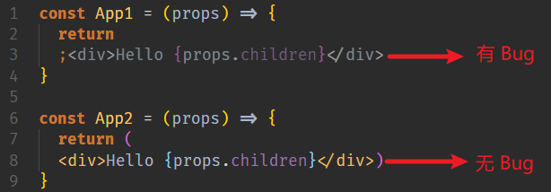
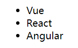
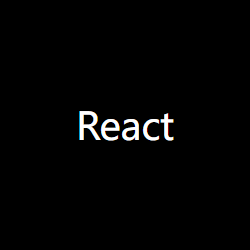

## JSX 基本介绍

### 目标

了解 JSX 的定义和使用，了解它的工作过程。

### 为什么要有 JSX

`React.createElement()` 创建 React 元素的问题：繁琐/不简洁；不直观，无法一眼看出所描述的结构；代码不容易维护！

React.createElement(

    'div',

    { className: 'wrap' },

    React.createElement('ul', null, React.createElement('li', null, 'React'), React.createElement('li', null, 'Vue'), React.createElement('li', null, 'Angular'))

)

对比下面 JSX 的写法

<div class="wrap">
    <ul>
        <li>React</li>
        <li>Vue</li>
        <li>Angular</li>
    </ul>
</div>

### JSX 是什么

JSX 是 JavaScript XML 的简写，表示可以在 JavaScript 代码中写 XML（HTML）格式的代码。

优势：声明式语法更加直观，与 HTML 结构相同，降低了学习成本，提高了开发效率，JSX 是 React 的核心之一。

### JSX 基本使用

1. 使用 JSX 创建 React 元素
```jsx
const title = <h1>Hello JSX</h1>
```

2. 使用 `ReactDOM.render()` 方法渲染 React 元素到页面中

```jsx
ReactDOM.render(title, document.querySelector('#root'))
```

### JSX 是如何工作的

🤔 换句话说，JSX 并不是标准的 ECMAScript 语法，为什么 React 脚手架中可以直接使用 JSX 呢？

- JSX 需要使用 Babel 编译成 `React.createElement()` 的形式，然后配合 React 才能在浏览器中使用，而 `create-react-app` 脚手架中已经内置了 Babel 及相关配置。
- 编译 JSX 语法的包为：[@babel/preset-react](https://www.npmjs.com/package/@babel/preset-react)，[在线体验](https://www.babeljs.cn/repl#?browsers=defaults%2C%20not%20ie%2011%2C%20not%20ie_mob%2011&build=&builtIns=false&corejs=3.6&spec=false&loose=false&code_lz=DwCwjAfAEgpgNnA9gAgFIGUAawD04JA&debug=false&forceAllTransforms=false&shippedProposals=false&circleciRepo=&evaluate=false&fileSize=false&timeTravel=false&sourceType=module&lineWrap=true&presets=env%2Creact%2Cstage-2&prettier=false&targets=&version=7.16.2&externalPlugins=&assumptions={})。

## JSX 注意点

### 内容

```jsx
const r = (
    <div className='wrap'>
        <h1>Hello World</h1>
        <p>React</p>
    </div>
)
```

1. 必须有 1 个根节点，或者虚拟根节点 `<></>`、`<React.Fragment></React.Fragment>`。
2. 属性名一般是驼峰的写法且不能是 JS 中的关键字，例如 class 改成 className，label 的 for 属性改为 `htmlFor`，colspan 改为 `colSpan`。
3. 元素若没有子节点，可以使用单标签，但一定要闭合，例如 `<span/>`。
4. `React@16.14` 之前需要先引入 React 才能使用 JSX（这个也好理解，因为 JSX 最后还是要被转成 `React.createElement()` 的形式）。
5. 换行建议使用 `()` 进行包裹，防止换行的时候 [自动插入分号](https://stackoverflow.com/questions/2846283/what-are-the-rules-for-javascripts-automatic-semicolon-insertion-asi) 的 Bug。



## 使用表达式

### 目标

掌握在 JSX 中使用表达式。

### 内容

**单大括号**中可以使用任意的表达式（可以产生结果的式子）。

- 普通的简单数据类型。

```jsx
const name = 'zs'
const age = 18
const title = (
    <h1>
        姓名：{name}, 年龄：{age}
    </h1>
)
```

- 对象中的属性。

```jsx
const car = {
    brand: '玛莎拉蒂',
}
const title = <h1>汽车：{car.brand}</h1>
```

- 数组中的某一项甚至整个数组。

```jsx
const friends = ['张三', '李四']
const title = <h1>汽车：{friends}</h1>
```

- 可以调用方法。

```jsx
function sayHi() {
    return '你好'
}
const title = <h1>姓名：{sayHi()}</h1>
```

### 注意

- JS 对象虽然也是表达式，但是不能直接嵌套在 `{}` 中，一般只会出现在 style 属性中。
- JSX 本身也是表达式。

```jsx
const span = <span>我是一个span</span>
const title = <h1>盒子{span}</h1>
```

### 小结

- JSX 中可以包含任意的表达式（除了对象）。
- JSX 中不能放语句，例如 `if`、`switch`、`for`、`while` 等。

## 条件渲染

### 目标

掌握条件渲染的写法。

### 内容

📝 需求：isLoading 是 true，显示“加载中…”，否则显示“加载完毕！”。

```js
import ReactDOM from 'react-dom'

const isLoading = true

const loadData = () => {
    if (isLoading) {
        return <h2>数据加载中，请稍后...</h2>
    }
    return <h2>数据加载完成，此处显示了加载后的数据</h2>
}

ReactDOM.render(loadData(), document.querySelector('#root'))
```

三元表达式的写法如下。

```js
const loadData = () => {
    return <h2>{isLoading ? '数据加载中，请稍后...' : '数据加载完成，此处显示了加载后的数据'}</h2>
}
```

## 列表渲染

### 目标

- 能在 JSX 中使用数组的 map 方法来生成列表结构。
- 了解 key 的作用。

### 需求

- 后端返回的数据。

```jsx
const arr = [
    { id: 1, name: 'Vue' },
    { id: 2, name: 'React' },
    { id: 3, name: 'Angular' },
]
```

- 期望实现的效果。



### 代码实现

手动拼接如下。

```jsx
<ul>
    <li>{list[0].name}</li>
    <li>{list[1].name}</li>
    <li>{list[2].name}</li>
</ul>
```

简化上面的代码：可以使用 `map()` 方法渲染一组数据。

```jsx
import ReactDOM from 'react-dom'

const list = [
    { id: 1, name: 'Vue' },
    { id: 2, name: 'React' },
    { id: 3, name: 'Angular' },
]

const arrJsx = list.map((item) => <li key={item.id}>{item.name}</li>)

const loadData = () => {
    return <ul>{arrJsx}</ul>
}

ReactDOM.render(loadData(), document.querySelector('#root'))
```

### 关于 key

1. 特点：key 值要保证唯一，尽量避免使用索引号，key 在最终的 HTML 结构中是看不见的。
2. 加在哪里：`map()` 遍历谁，就把 key 加在谁上。
3. 作用：React 内部用来进行**性能优化**时使用的，key 在最终的 HTML 结构中是看不见的。

## 样式处理

### 目标

掌握 React 中使用样式的两种方式。

### 行内样式

- 语法

```jsx
<元素 style={ {css属性1：值1,css属性2：值2} }></元素>
```

- 需求



- 代码

```jsx
<div style={{ width: 200, height: 200, lineHeight: '200px', backgroundColor: 'black', color: 'white', textAlign: 'center', fontSize: 30 }}>React</div>
```

- 注意点

  a，为啥有两个 `{{ }}`，外层的 `{}` 表示要开始写 JS 表达式了，内层的 `{}` 表示是一个对象。

  b，属性名是小驼峰格式，例如 `background-color` 需要写成 `backgroundColor`。

  c，属性值是字符串，如果单位是 px，可以简写成数值。

### className

- 用 `className` 定义类名。
- 在 `src` 目录中准备 `index.css` 文件，然后在 `index.js` 文件中通过 `import './index.css'` 引入文件。

```jsx
//index.css
.title {
    width: 200px;
    height: 200px;
    color: white;
    background-color: black;
}
//index.js
import './index.css';
<div className='title'>Hello React</div>
```
