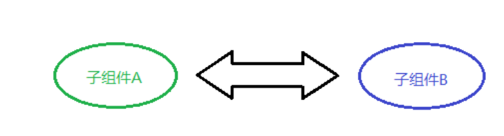
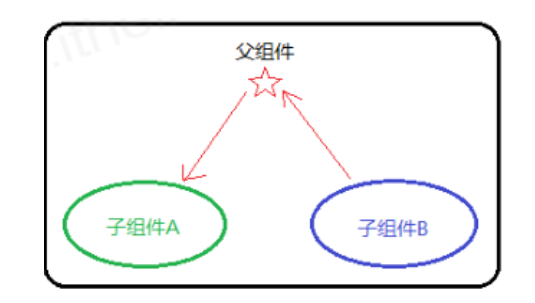

## 组件通讯介绍

**目标**：了解为什么需要组件通讯？

**内容：**

-   _组件_是独立且封闭的单元，默认情况下，只能使用组件自己的数据。
    
-   在组件化过程中，我们将一个完整的功能拆分成多个组件，以更好的完成整个应用的功能。
    
-   而在这个过程中，多个组件之间不可避免的要共享某些数据
    
-   为了实现这些功能，就需要`打破组件的独立封闭性`，让其与外界沟通。这个过程就是**组件通讯**。
    
-   组件通信常见的方式有：父传子、子传父、兄弟相传、跨组件通信等。


**总结**

1.  _组件中的状态是私有的_，也就是说，组件的状态只能在组件内部使用，无法直接在组件外使用

## props基本使用

**目标：**能够使用组件的props实现传递数据和接收数据

**内容：**

- prop: property 属性的简写
- 使用场景：组件接收外部数据时
- 作用：接收（其他组件）传递给当前组件的数据
- 如何传递？给组件标签添加属性，就表示给组件传递数据
- 如何接收？函数组件通过参数 `props` 接收数据，类组件通过 `this.props` 

**核心代码：**

+ 函数组件获取props

```js
// 接收数据：
// props 的值就是：{ name: 'jack', age: 19 }
function Hello(props) {
  return (
    <div>接收到数据:{props.name}</div>
  )
}

// 传递数据：
// 可以把传递数据理解为调用函数 Hello，即：Hello({ name: 'jack', age: 19 })
<Hello name="jack" age={19} />
```
+ 类组件获取props

```js
// 接收数据：
// class 组件需要通过 this.props 来获取
class Hello extends Component {
  render() {
    return (
      <div>接收到的数据:{this.props.age}</div>
    ) 
  }
}

// 传递数据：
<Hello name='jack' age={19} />
```

## props的注意点

**目标：** 了解props的特点，知道什么是单向数据流

**内容：**

+ **props 是只读对象**，只能读取对象中的属性，无法修改
  + `单向数据流`，也叫做：自上而下的数据流
  + 表示：父组件中的数据可以通过 props 传递给子组件，并且，当父组件中的数据更新时，子组件就会自动接收到最新的数据
  + 父组件的数据更新会流动到子组件，不能反过来，子组件直接去修改父组件的数据
  + 类比：就像瀑布的水一样只能从上往下流动，并且，当上游的水变浑浊，下游的水也会受到影响
+ 可以传递任意数据（数字  字符串  布尔类型 数组 对象 函数 jsx）
  + 如果是字符串类型，可以直接传递
  + 如果是其他类型，需要在`{}`中提供
+ 使用类组件时，如果写了构造函数，应该在 constructor 中接收 props，并将 props 传递给 super，否则无法在构造函数中使用 this.props。

## 组件通讯-父传子

**目标**：将父组件的数据，传递给子组件

**内容**：

+ 父组件提供要传递的state数据
+ 给子组件标签添加属性，值为 state 中的数据
+ 子组件中通过 props 接收父组件中传递的数据

**核心代码**

父组件提供数据并且传递给子组件

```js
class Parent extends React.Component {
    state = { money: 10000 }
    render() {
        return (
            <div>
                传递数据给子组件：<Child name={this.state.money} />
            </div>
        )
    }
}
```

子组件接收数据

```js
function Child(props) {
	return <div>子组件接收到数据：{props.money}</div>
}
```

## 组件通讯-子传父练习

### 目标


### 准备父组件

数据、结构、样式

```jsx
//components/Parent/index.js
import React, { Component } from 'react'
import Child from '../Child'
import './index.css'

class Parent extends Component {
    state = {
        list: [
            {
                id: 1,
                name: '超级好吃的棒棒糖',
                price: 18.8,
                info: '开业大酬宾，全场8折',
            },
            {
                id: 2,
                name: '超级好吃的大鸡腿',
                price: 34.2,
                info: '开业大酬宾，全场8折',
            },
            {
                id: 3,
                name: '超级无敌的冰激凌',
                price: 14.2,
                info: '开业大酬宾，全场8折',
            },
        ],
    }
    render() {
        return (
            <div className='parent'>
                <Child></Child>
                <Child></Child>
            </div>
        )
    }
}

export default Parent

//components/Parent/index.css
.parent {
    width: 400px;
    margin: 60px auto 0;
    border: 2px solid #333;
}
```

### 准备子组件

结构、样式

```jsx
//components/Child/index.js
import React, { Component } from 'react'
import './index.css'

export default class Child extends Component {
    render() {
        return (
            <div className='child'>
                <h3 className='title'>标题：超级好吃的棒棒糖</h3>
                <p className='price'>价格：18.8</p>
                <p className='product'>开业大酬宾，全场8折</p>
            </div>
        )
    }
}

//components/Child/index.css
.child {
    border: 1px solid #333;
    margin: 20px;
    padding: 10px;
}
```

### 传递数据

```jsx
//components/Parent/index.js
import React, { Component } from 'react'
import Child from '../Child'
import './index.css'

class Parent extends Component {
    {/* ... */}
    render() {
        return (
            <div className='parent'>
                {this.state.list.map((item) => (
                    <Child key={item.id} {...item} />
                ))}
            </div>
        )
    }
}

//components/Child/index.js
import React, { Component } from 'react'
import './index.css'

export default class Child extends Component {
    render() {
        const { name, price, info } = this.props
        return (
            <div className='child'>
                <h3 className='title'>标题：{name}</h3>
                <p className='price'>价格：{price}</p>
                <p className='info'>{info}</p>
            </div>
        )
    }
}
```

### 完整代码

```jsx
//components/Parent/index.js
import React, { Component } from 'react'
import Child from '../Child'
import './index.css'

class Parent extends Component {
    state = {
        list: [
            {
                id: 1,
                name: '超级好吃的棒棒糖',
                price: 18.8,
                info: '开业大酬宾，全场8折',
            },
            {
                id: 2,
                name: '超级好吃的大鸡腿',
                price: 34.2,
                info: '开业大酬宾，全场8折',
            },
            {
                id: 3,
                name: '超级无敌的冰激凌',
                price: 14.2,
                info: '开业大酬宾，全场8折',
            },
        ],
    }
    render() {
        return (
            <div className='parent'>
                {this.state.list.map((item) => (
                    <Child key={item.id} {...item} />
                ))}
            </div>
        )
    }
}

export default Parent
//components/Child/index.js
import React, { Component } from 'react'
import './index.css'

export default class Child extends Component {
    render() {
        const { name, price, info } = this.props
        return (
            <div className='child'>
                <h3 className='title'>标题：{name}</h3>
                <p className='price'>价格：{price}</p>
                <p className='info'>{info}</p>
            </div>
        )
    }
}
```

## 组件通讯-子传父

**目标：能够将子组件的数据传递给父组件**

**内容**：

思路：利用回调函数，父组件提供回调，子组件调用，将要传递的数据作为回调函数的参数。

1. 父组件提供一个回调函数（用于接收数据）（箭头函数）
2. 将该函数作为属性的值，传递给子组件
3. 子组件通过 props 调用回调函数
4. 将子组件的数据作为参数传递给回调函数

**核心代码**：

父组件提供函数并且传递给子组件

```js
class Parent extends React.Component {
     // 注意这个函数要是箭头函数，保证 this 指向自己的组件实例
    getChildMsg = (msg) => {
        console.log('接收到子组件数据', msg)
    }
    render() {
        return (
            <div>
             /* #1 父组件提供回调函数 */
            	子组件：<Child getMsg={this.getChildMsg} />
            </div>
        )
    }
}
```

子组件接收函数并且调用

```js
class Child extends React.Component {
    state = { childMsg: 'React' }
    handleClick = () => {
    	this.props.getMsg(this.state.childMsg)
    }
    return (
    	<button onClick={this.handleClick}>点我，给父组件传递数据</button>
    )
}
```

**总结**：

 + 子组件如何给父组件传递数据？
 + 父组件如何接收子组件传递的数据？
 + 父组件的数据更新后，子组件会不会自动更新？

**子传父的数据流向**


## 组件通讯-子传父练习

**目标：**


## 组件通讯-兄弟组件

**目标：**能够理解什么是状态提升，并实现兄弟组件之间的组件通讯

**内容**：

+ 将共享状态提升到最近的公共父组件中，由公共父组件管理这个状态
+ 思想：**状态提升**
+ 公共父组件职责：
  + 提供共享状态 
  + 提供操作共享状态的方法
+ 要通讯的子组件只需通过 props 接收状态或操作状态的方法

状态提升前




状态提升之后



**核心代码**

+ `index.js`

```jsx
import React, { Component } from 'react'
import ReactDOM from 'react-dom'
import Jack from './Jack'
import Rose from './Rose'
class App extends Component {
  // 1. 状态提升到父组件
  state = {
    msg: '',
  }
  render() {
    return (
      <div>
        <h1>我是App组件</h1>
        <Jack say={this.changeMsg}></Jack>
        {/* 2. 把状态给子组件显示 */}
        <Rose msg={this.state.msg}></Rose>
      </div>
    )
  }
  changeMsg = (msg) => {
    this.setState({
      msg,
    })
  }
}

// 渲染组件
ReactDOM.render(<App />, document.getElementById('root'))
```

+ `jack.js`

```jsx
import React, { Component } from 'react'

export default class Jack extends Component {
  render() {
    return (
      <div>
        <h3>我是Jack组件</h3>
        <button onClick={this.say}>说</button>
      </div>
    )
  }
  say = () => {
    this.props.say('you jump i look')
  }
}

```

+ `rose.js`

```jsx
import React, { Component } from 'react'

export default class Rose extends Component {
  render() {
    return (
      <div>
        <h3>我是Rose组件-{this.props.msg}</h3>
      </div>
    )
  }
}

```

## 组件通讯 - Context

**目标：**通过context实现跨级组件通讯

**内容**  

+ 组件之间的层级关系，除了以上两种常见的情况外，还有一种不太常见的情况，那就是：远房亲戚关系（也就是两个组件之间间隔较远） 

  
  

+ 实现方式：使用 Context 来实现跨组件传递数据

+ Context: 上下文， 可以理解成一个范围，只要在这个范围内，就可以直接跨组件进行通讯。

### 步骤


1. 祖先组件通过 `React.createContext()` 创建 Context 并导出。
2. 祖先组件通过 `<Context.Provider>` 配合 value 属性提供数据。
3. 后代组件通过 `<Context.Consumer>` 配合函数获取数据。
4. 优化：提取 `React.createContext()` 到单独的文件里面。

### 代码

```jsx
//App.jsx
import React, { Component, createContext } from 'react'
import A from './A'

export const context = createContext()

export default class App extends Component {
    state = {
        money: 8888,
    }
    changeMoney = (n) => {
        this.setState({
            money: this.state.money + n,
        })
    }
    render() {
        return (
            <context.Provider
                value={{
                    money: this.state.money,
                    changeMoney: this.changeMoney,
                }}
            >
                App
                <hr />
                <A />
            </context.Provider>
        )
    }
}
//A.jsx
import React, { Component } from 'react'
import B from './B'

export default class A extends Component {
    render() {
        return (
            <div>
                A
                <hr />
                <B />
            </div>
        )
    }
}
//B.jsx
import React, { Component } from 'react'
import { context } from './App'

export default class B extends Component {
    render() {
        return (
            <context.Consumer>
                {(value) => {
                    return (
                        <div>
                            <h1>{value.money}</h1>
                            <button onClick={() => value.changeMoney(8)}>changeMoney</button>
                        </div>
                    )
                }}
            </context.Consumer>
        )
    }
}
```

### 另一种获取数据的方式

```jsx
import React, { Component } from 'react'
import { Context } from '../../context'

export default class B extends Component {
    // 声明一个静态属性 contextType 等于 Context 对象
    static contextType = Context
    // 然后就可以通过 this.context 拿到传递过来的数据啦
    render() {
        return <div>B {this.context.age}</div>
    }
}
```

### 指定默认值

注意默认值生效的条件：并不是不传递 value，而是没有找到包裹 Context.Provider 的祖先元素

```jsx
import React from 'react'
export const Context = React.createContext({
    age: 88,
})
```