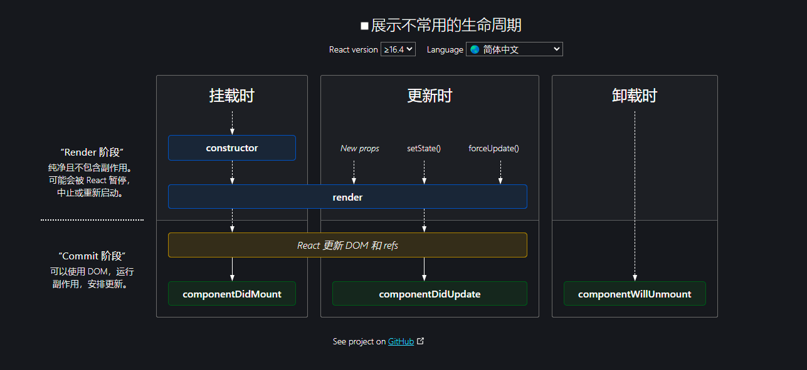

# React 组件进阶

+ children属性
+ props校验
+ props默认值
+ 生命周期与钩子函数
+ setState的延迟更新

## children属性

**目标：**掌握props中children属性的用法

**内容**：

+ children属性：表示该组件的子节点，只要组件有子节点，props就有该属性

+ children 属性与普通的props一样，值可以是任意值（文本、React元素、组件，甚至是函数）

**核心代码**

```jsx
function Hello(props) {
  return (
    <div>
      该组件的子节点：{props.children}
    </div>
  )
}

<Hello>我是子节点</Hello>
```

## props校验  

**目标：**校验接收的props的数据类型，增加组件的健壮性

**内容：** 

对于组件来说，props是外来的，无法保证组件使用者传入什么格式的数据 

如果传入的数据格式不对，可能会导致组件内部报错。**组件的使用者不能很明确的知道错误的原因。** 

```jsx
// 假设，这是 小明 创建的 List 组件
const List = props => {
  const arr = props.colors
  const lis = arr.map((item, index) => <li key={index}>{item.name}</li>)
	return (
		<ul>{lis}</ul>
	)
}

// 小红使用小明创建的 List 组件
<List colors={19} />
```

**核心代码：**

+ 使用`组件名.propTypes = {}` 来给组件的props添加校验规则
+ 导入 `prop-types` 包 
+ 校验规则通过 `PropTypes` 对象来指定

```jsx
import PropTypes from 'prop-types'
function App(props) {
    return (
    	<h1>Hi, {props.colors}</h1>
    )
}
App.propTypes = {
    // 约定colors属性为array类型
    // 如果类型不对，则报出明确错误，便于分析错误原因
    colors: PropTypes.array
}
```

**总结：**

通过props校验，能够增强组件的健壮性

## props校验-规则

**目标：**了解react组件props校验的[常见规则](https://zh-hans.reactjs.org/docs/typechecking-with-proptypes.html) 

**内容：**

1. 常见类型：array、bool、func、number、object、string
2. React元素类型：element
3. 必填项：isRequired

**核心代码**

```jsx
// 常见类型
optionalFunc: PropTypes.func,
// 必选
requiredFunc: PropTypes.func.isRequired,

```

> **注意：**当我们使用typescript之后，props校验就不需要了

## props默认值

**目标：**给组件的props提供默认值

**内容：**

通过`defaultProps`可以给组件的props设置默认值，在未传入props的时候生效

**核心代码：**

```jsx
function App(props) {
    return (
        <div>
            此处展示props的默认值：{props.pageSize}
        </div>
    )
}
// 设置默认值
App.defaultProps = {
	pageSize: 10
}
// 不传入pageSize属性
<App pageSize={1}/>
```

## 类的静态属性-static

**目标：**能够通过类的static语法简化props校验和默认值

**内容：**

+ 实例成员: 通过实例调用的属性或者方法，，，叫做实例成员（属性或者方法）
+ 静态成员：通过类或者构造函数本身才能访问的属性或者方法

**核心代码**

```jsx
class Person {
   name = 'zs',
   static age = 18
   sayHi() {
       console.log('哈哈')
   }
   static goodBye() {
       console.log('byebye')
   }
}

const p = new Person()

console.log(p.name)
p.sayHi()

console.log(Person.age)
Person.goodBye()
```

## 组件生命周期-概述

**目的：**能够理解什么是组件的生命周期以及为什么需要研究组件的生命周期

**内容：**

+ 生命周期：一个事物从创建到最后消亡经历的整个过程 
+ 组件的生命周期：组件从被创建到挂载到页面中运行，再到组件不用时卸载的过程

+ 意义：组件的生命周期有助于理解组件的运行方式、分析组件错误原因等
+ 钩子函数的作用：为开发人员在不同阶段操作组件提供了时机。
+ **只有 类组件 才有生命周期。**


## 组件生命周期-整体说明

**目标：**能够说出组件生命周期总共有几个阶段。

**内容：**

+ <http://projects.wojtekmaj.pl/react-lifecycle-methods-diagram/>



## 组件生命周期-挂载阶段

**目标：**能够说出组件的挂载阶段的钩子函数以及执行时机

**内容：**

+ 执行时机：组件创建时（页面加载时）

+ 执行顺序：


| 钩子函数          | 触发时机                  | 作用                                     |
| ----------------- | ------------------------- | ---------------------------------------- |
| constructor       | 创建组件时，最先执行      | 1. 初始化state  2. 创建Ref等             |
| render            | 每次组件渲染都会触发      | 渲染UI（**注意： 不能调用setState()** ） |
| componentDidMount | 组件挂载（完成DOM渲染）后 | 1. 发送网络请求   2.DOM操作              |

## 组件生命周期-更新阶段  

**目标：**能够说出组件的更新阶段的钩子函数以及执行时机

**内容：**

+ 执行时机：1. setState() 2. forceUpdate() 3. 组件接收到新的props
+ 说明：以上三者任意一种变化，组件就会重新渲染
+ 执行顺序


| 钩子函数           | 触发时机                  | 作用                                                 |
| ------------------ | ------------------------- | ---------------------------------------------------- |
| render             | 每次组件渲染都会触发      | 渲染UI（与 挂载阶段 是同一个render）                 |
| componentDidUpdate | 组件更新（完成DOM渲染）后 | DOM操作，可以获取到更新后的DOM内容，不要调用setState |

## 组件生命周期-卸载阶段

**目标：**能够说出组件的销毁阶段的钩子函数以及执行时机

**内容**   

+ 执行时机：组件从页面中消失  

| 钩子函数             | 触发时机                 | 作用                               |
| -------------------- | ------------------------ | ---------------------------------- |
| componentWillUnmount | 组件卸载（从页面中消失） | 执行清理工作（比如：清理定时器等） |

## B站评论列表案例-本地存储

**目标**：能够实现B站评论列表案例的数据持久化

**步骤**：

1. 在组件挂载的钩子函数中，从本地存储中读取 list 数据
2. 将读取到的 list 数据，更新到状态中
3. 在组件更新的钩子函数中，将最新的 list 数据存到本地存储中

**核心代码**：

```jsx
componentDidUpdate() {
  localStorage.setItem('list', JSON.stringify(this.state.list))
}

componentDidMount() {
  const list = JSON.parse(localStorage.getItem('list') || '[]')
  this.setState({ list })
}
```

## setState进阶-延迟更新

**目的**：能够理解setState延迟更新数据

**内容：**

+ setState方法同步的，但是表现为延迟更新状态（**注意：并不是异步更新**）
+ 延迟更新状态的说明：
  - 调用 setState 时，将要更新的状态对象，放到一个更新队列中暂存起来（没有立即更新）

  - 如果多次调用 setState 更新状态，**状态会进行合并，后面覆盖前面**

  - 等到所有的操作都执行完毕，React 会拿到最终的状态，然后触发组件更新
+ 优势：多次调用 setState() ，只会触发一次重新渲染，提升性能

```js
this.state = { count: 1 }
this.setState({
	count: this.state.count + 1
})
console.log(this.state.count) // 1
```

在使用 React.js 的时候，并不需要担心多次进行 `setState` 会带来性能问题。

## setState进阶-推荐语法

**目标：**能够掌握setState箭头函数的语法，解决多次调用依赖的问题

**内容：**

+  推荐：使用 `setState((preState) => {})` 语法

+  参数preState: React.js 会把上一个 `setState` 的结果传入这个函数

```js
this.setState((preState) => {
    return {
    	count: preState.count + 1
    }
})
console.log(this.state.count) // 1
```

**这种语法依旧是异步的，但是state可以获取到最新的状态，适用于需要调用多次setState**

## setState进阶-第二个参数

**目标：**能够使用setState的回调函数，操作渲染后的DOM

**内容：**

+ 场景：在状态更新（页面完成重新渲染）后立即执行某个操作
+ 语法：`setState(updater[, callback])`

```js
this.setState(
	(state) => ({}),
	() => {console.log('这个回调函数会在状态更新后立即执行')}
)
```

## setState进阶-同步or异步

**目标：**能够说出setState到底是同步的还是异步

**内容：**

+ setState本身并不是一个异步方法，其之所以会表现出一种异步的形式，是因为react框架本身的一个性能优化机制
+ React会将多个setState的调用合并为一个来执行，也就是说，当执行setState的时候，state中的数据并不会马上更新
+ setState如果是在react的生命周期中或者是事件处理函数中，表现出来是*异步的*
+ setState如果是在setTimeout/setInterval或者原生事件中，表现出来是*同步的*

**总结：**

+ setState是同步的方法，但是react为了性能优化，所以setState在react的事件中表现得像异步。
+ 参考链接：https://zhuanlan.zhihu.com/p/158725289

