**前言：** 今天在项目中遇到了后端**接口参数类型**和**接口返回值**需要修改的场景，由于这个函数在很多页面都用到了，就导致改完相关 **api** 函数的时候 **TS** 疯狂报错，所有的参数和返回值都需要跟着改，一时间头疼。正当我手足无措的时候，突然想到之前看 **vue** 源码的时候看到 **函数重载** 的使用，于是我第一次在项目中使用了**函数重载**，完美解决了我的问题。

___

## 一. 场景再现

1. 我们先不要想函数重载是什么意思，我们从具体场景一步一步去了解这个名词的含义，你会理解的更深刻。
2. 假设现在后端有一个接口，可以通过一个 `ID` 来获取用户信息。那么前端对应的 `api` 可能就有这样一个函数，

   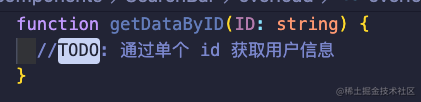

3. 现在还有一个接口，就是通过很多个 `ID` 来获取很多个用户的信息。那么这个函数就可能被设计成这样子。

   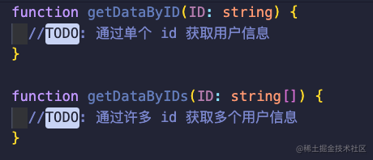

4. 等等，先别着急喷。别说是你，我自己看着都感觉这种方式很蠢，为什么不把它设计成一个函数呢？哎，对哈，那我们就动手改造一下这两个函数。

   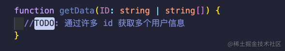

5. 既然参数类型不同，那么后端对应的返回值类型肯定也是不一样滴，我们还需要设定一下返回值类型。我们随手定一个一个 `interface` 来表示这个后端接口返回给我们的数据类型。

   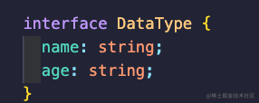

   所以现在我们的函数就变成了下面这个样子。

   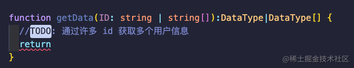

6. 这时候就需要前端手动去判断传递的参数到底是单个字符串还是一个字符串数组。
   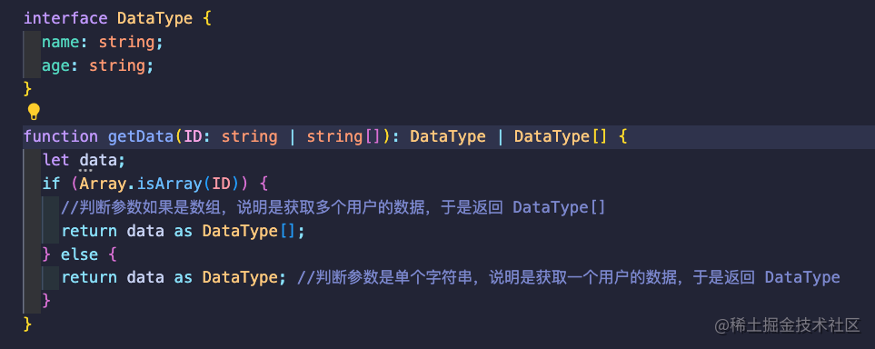

7. 乍一看感觉还挺好，但是你会发现当你在调用这个函数的时候，`TS` 的类型提示好像不是那么对劲。什么意思呢？我们直接调用这个函数看一下类型提升现在是什么样子的。

   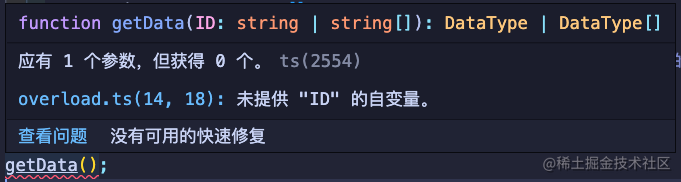

   你可能会说，你骗谁呢？这类型提示不是好好的吗？别着急，容我们再声明一个变量准备接收这个函数的返回值。

8. 现在我在一个组件内部很明确的知道我要发送一个 `ID数组` 去获取很多用户的数据。那么我可以很清楚的定义我们的变量就是 `DataType[]` 的类型。

   

（**这里需要特别提醒**：虽然现在我只发生了一个用户的数据，但是后端根据我的参数类型是一个数组，仍会返回一个数组类型的用户数据给我，即使那个数组只有一条用户数据。）

1. 那么我们就可以很自然的写出下面的代码。

   

   随之你就会发现 `TS` 飘红了，你函数的返回值类型和变量定义时候规定的类型不符合。

   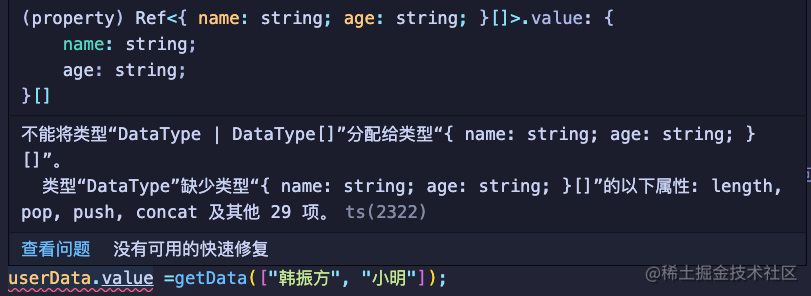

2. 错误原因很简单，**就是我们人类的直觉**。我们很聪明的认为，我给你传递的如果是一个字符串，那么你这个函数就应该很听话的给我返回 **一** 个用户信息就完事了。我给你这个函数如果传递的是一个字符串数组，那么我就是我想获取**多个**用户的信息，你就应该给我返回一个信息数组。但是很抱歉 `TS` 没有这么智能，它确实不知道你到底是想一个 `一个字符串 返回==>一个数据`，还是 `一个字符串 返回==> 多个数据`。

    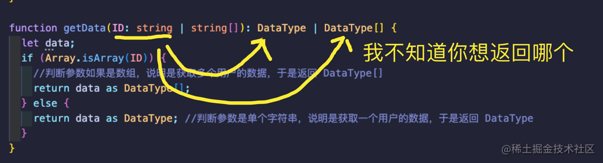

    是的，`TS` 目前只知道你的参数只有两个类型，你的返回值只有两个类型，但是它不知道你的参数对应的你想返回哪个类型。

## 二. 解决飘红的方法

1. 那么我们如何解决目前 `TS` 飘红的问题呢？

    

2. 第一种方法也是最简单的方法，直接使用 `TS` 类型断言 `as` 关键词，明确的告诉 `TS` 你这个函数的返回值是什么。

    

    `as` 的作用你可以类比于 `CSS` 中的 `important`，我非常确定这个变量的类型是什么，不需要 `TS` 帮我做类型推导。

3. 这也是我最开始使用的方法，也是我最经常使用的方法。你可能也看出来了，这样的话我就需要在每一个使用这个函数的地方都 `as` 一下，非常非常笨也不优雅。
4. 那有没有什么方法让 `TS` 变聪明一点，让它帮我自动分辨我各个参数对应什么返回值呢？你别说，还真有，引出我们的主角 ----**函数重载**。

## 三. 什么是函数重载 (overload)

1. 在引出**函数重载**之前我们需要了解一个前提知识，在 JS 里同一个函数是可以被声明多次的，结果是会优先采用最后一次的函数体。什么意思呢？如下图，这是一个 `.js` 文件，JS 不仅不会报错，并且还可以正常执行。

    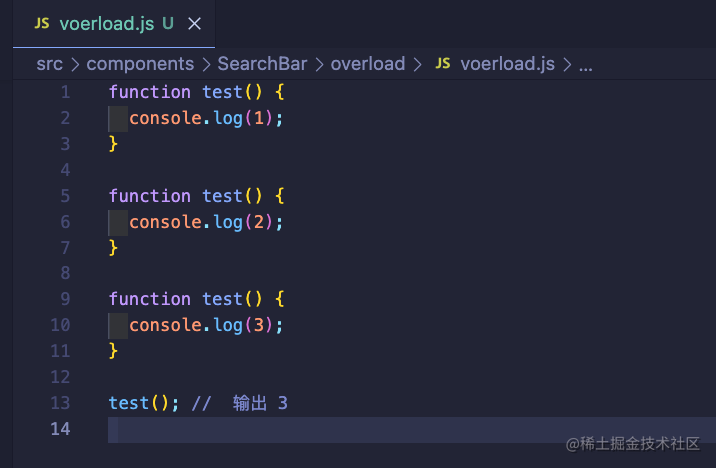

2. 然而在 TS 里这种方式是会引发类型报错的。虽然 TS 只是会提醒类型错误，不影响这个文件的最终运行。但是明眼人都可以看出哪种开发模式更加适合团队合作。很明显 `TS` 更加符合我们的直觉，不允许变量在同一作用域下多次赋值。

    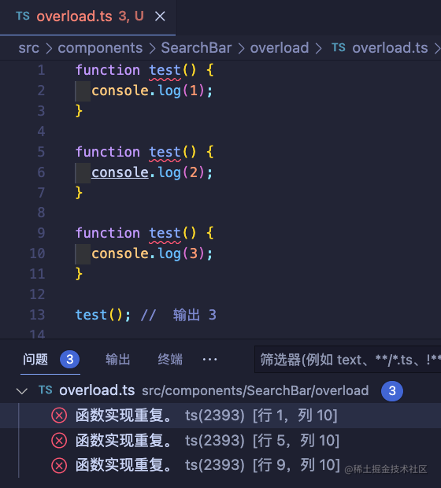

3. 所以 JS 是没有重载签名这个概念的，这是 `TS` 所给你带来的优势。关于函数重载更加深刻的实现原理，由于使用的不多我暂时无法给你深入讲解原理，在这里我仅谈一谈目前我个人理解，可能有些大白话，但是应该可以帮你先浅浅的了解这个名词。

    > 函数重载的概念主要由两部分组成。1.重载签名 2.实现签名

## 四. 重载签名

1. 我们先说重载签名，我们知道函数基本上是由四部分组成：**一个函数名，一个函数参数，一个函数体，一个返回值。**

    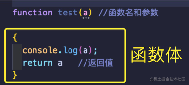

2. `TS` 可以帮你分别约束 **参数类型**和**返回值类型**，也就是下面这两个。

    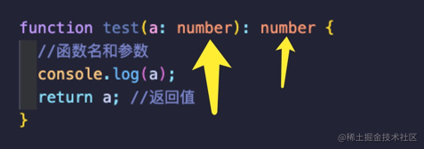

3. 而**重载签名**的意思就是只需要你提供一个函数的**参数类型**和**返回值类型**，不需要你提供函数体。什么意思呢？这里我们还拿刚刚获取用户信息 `getData` 举例子。

    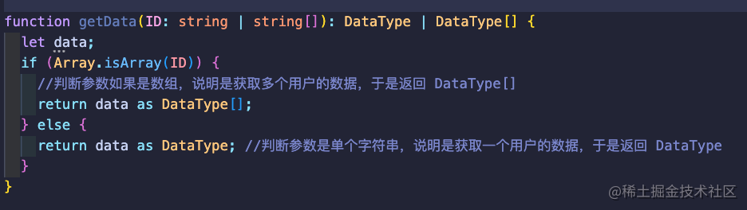

4. 我们就可以声明一个同名函数。`getData` 按照上面刚刚讲到的，我们只约束它的**参数类型**和**返回值类型**。我们发现，`TS` 竟然没有报错。

    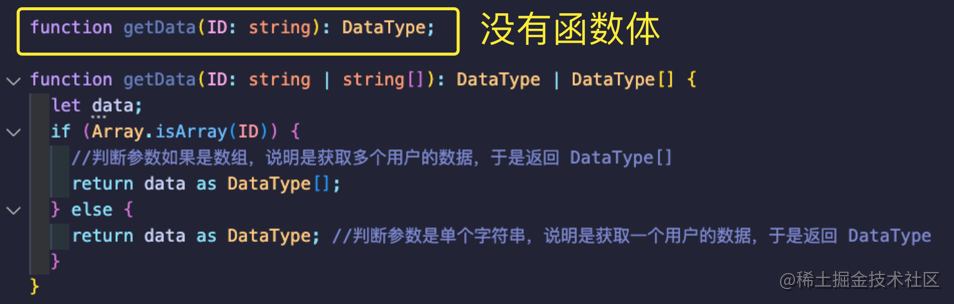

5. 按照同样的思路，我们再声明一个通过 `ID数组` 获取多个用户信息的函数。

    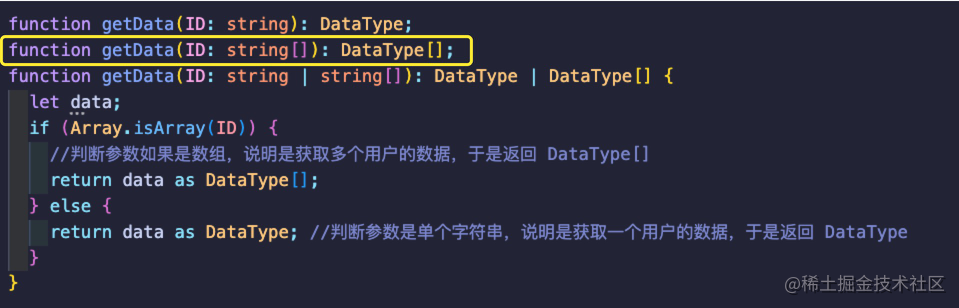

6. 如果你留心的话，到现在我们其实已经实现了函数重载。你会发现我们现在已经不需要 `as` 去告诉 `TS` 类型了，它已经帮我们完成了推导。
    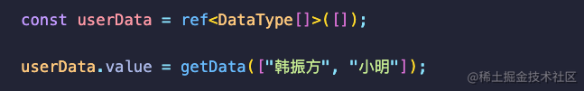
7. 我们换一下参数类型，我们把参数类型换成一个字符串看看是什么结果。你会发现，`TS` 非常聪明的推断出，你想要的结果是一个用户的数据，并不是多个用户的数据，所以提示你参数错误。

    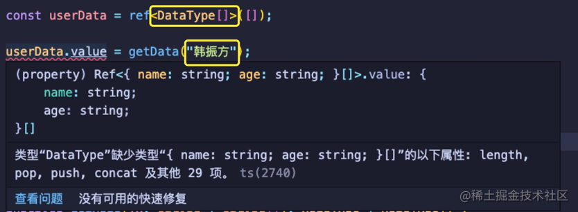

8. 我们改一下 `userData` 的类型来确认一下我们的猜想是否正确。

    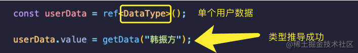

    `TS` 没有报错，果然是我们所想的那样。

## 五. 实现签名

1. 聪明的你可能已经猜到了，实现前面其实就是一个带有函数体的同名函数。并且这个函数的**参数类型**要完全包含**函数签名**的**所有类型**。

    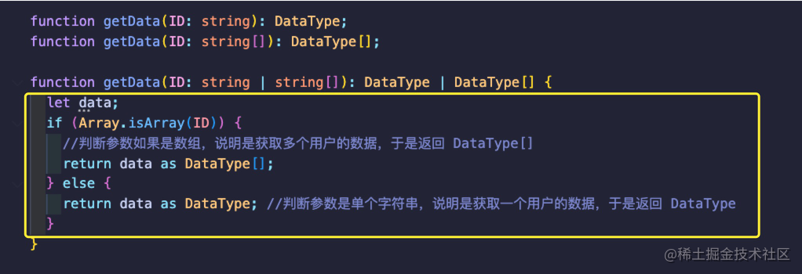

2. 什么意思呢？我们删除了 `string数组` 的参数类型。你会发现第二个函数签名飘红报错了。

    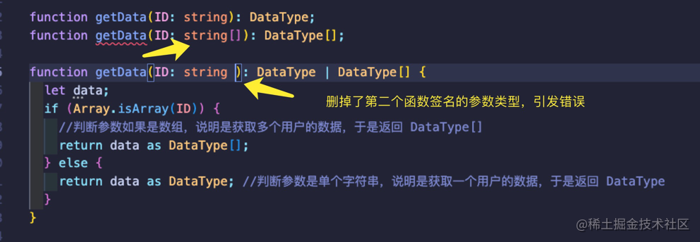

    错误信息如下：

    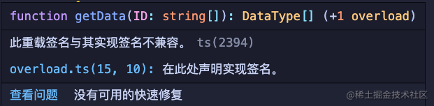

3. 实现签名的返回值同理，不再过多赘述。
4. 最重要的一点来了，你需要在实现签名内非常明确的判断出不同类型的参数所对应的返回值。才能让 `TS` 去实现精确的类型推导。

    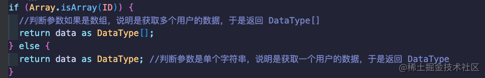

5. 至此你已经完成了标题的功能 ---- **函数重载**。

## 六. 额外知识

1. 函数重载可以有多个重载签名，但是只允许有一个实现签名。说白了就是一个函数名只能有一个函数体。
    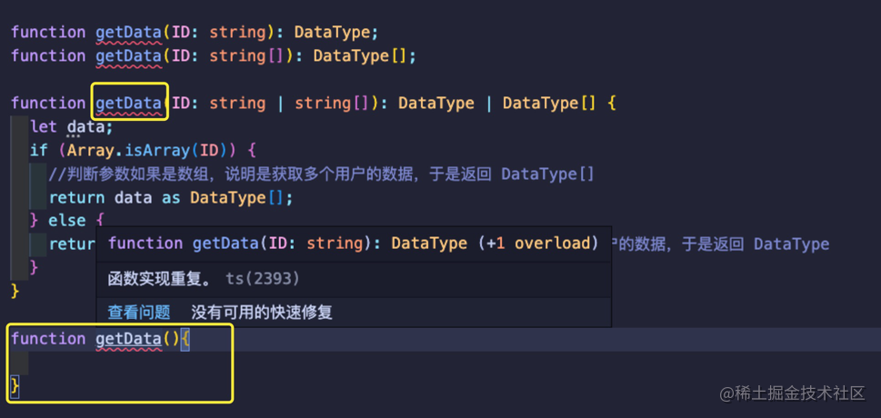
2. 函数重载不仅仅只能约束参数类型，还能根据参数的数量去返回不同的类型的返回值。（`arguments`：别忘了函数内还有我这个对象。T.T）
3. **Class** 类也可以实现 `constructor` 的重载。
4. 也许你早就遇到过 `TS` 给你抛出的这个错误，但是你之前可能不知道是什么引起的。心里默念（overload+1）到底是什么鬼啊！

    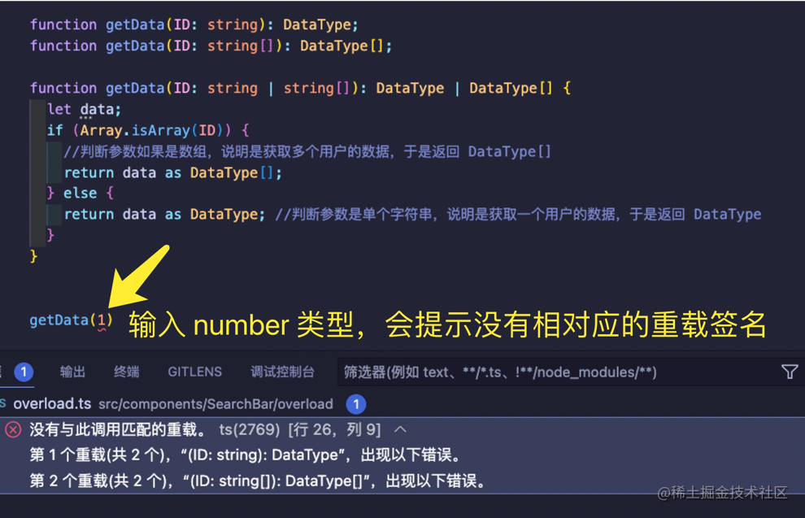

## 结语

`TS` 真是越用越香！！！🎁
