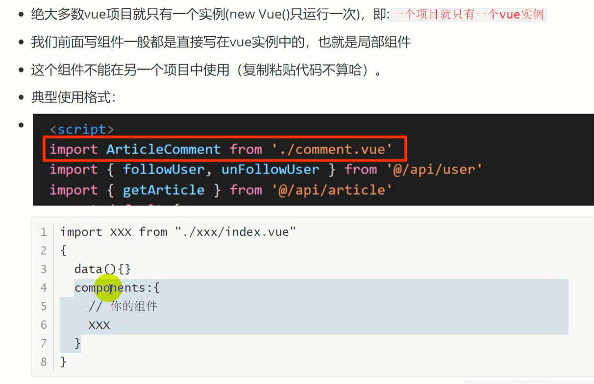

# Vue2 组件封装

## 一. 基本介绍

**目标**：自己造轮子

- 自己动手封装一个**公共组件库**
- 放在npm上，其他用户可以使用`npm i yourUIName`来下载使用组件

**意义**：

- 更加深入的学习vue组件相关知识

  - 组件数据共享，时间，props，插槽

  - Vue.component(),render()

  - 如何开发Vue插件：Vue.use

- 学会封装一个公共组件库，打包，发布到npm，迭代开发

- 有利用提高竞争力

**学习内容**：

- Vue.use()
- 用vuecli创建项目，并用webpack把项目打包成组件库
- 发布到npm
- 插槽：具名插槽和默认插槽
- sync
- render
- 虚拟dom
- `$attrs/$listeners`

## 二. 公共组件的创建和使用

### 1. 全局组件和局部组件

#### 1.1 局部组件



**示例**：

```html
<!DOCTYPE html>
<html lang="en">

<head>
  <meta charset="UTF-8">
  <meta http-equiv="X-UA-Compatible" content="IE=edge">
  <meta name="viewport" content="width=device-width, initial-scale=1.0">
  <title>Document</title>
</head>

<body>
  <div id="app">
    <my-button></my-button>
  </div>
  <script src="https://cdn.jsdelivr.net/npm/vue@2/dist/vue.js"></script>
  <script>
    const vm = new Vue({
      el: "#app",
      components: {
        "MyButton": {
          template: "<button>局部组件</button>"
        }
      }
    })

  </script>
</body>

</html>
```


#### 1.2 全局组件

> 注意：在非单文件组件（非.vue文件）中，模板中的组件名不能使用大驼峰命名


**示例：**

```html
<!DOCTYPE html>
<html lang="en">

<head>
  <meta charset="UTF-8">
  <meta http-equiv="X-UA-Compatible" content="IE=edge">
  <meta name="viewport" content="width=device-width, initial-scale=1.0">
  <title>Document</title>
</head>

<body>
  <div id="app1">
    <my-component></my-component>
  </div>
  <div id="app2">
    <my-component></my-component>
  </div>
  <script src="https://cdn.jsdelivr.net/npm/vue@2/dist/vue.js"></script>
  <script>
    Vue.component('MyComponent', {
      template: "<div>全局组件</div>"
    })
    const vm1 = new Vue({
      el: '#app1'
    })
    const vm2 = new Vue({
      el: '#app2'
    })
  </script>
</body>

</html>
```

### 2. 使用 Vue.use()加载组件

#### 2.1 Vue.use()说明

Vue.use()是Vue对象上的全局方法，它用来把第三方插件挂载在vue上

> 注意：Vue.use()中的Vue首字母必须大写

**示例**

```js
import Vue from 'vue'
import VueRouter from 'vue-router'
Vue.use(VueRouter)
```

#### 2.2 格式

```js
Vue.use(plugin)
```

- 功能：安装Vue.js插件
- 参数：plugin。表示要安装的插件。可以是对象或者函数
- 用法：如果plugin是一个对象，则其必须提供install方法，如果是一个函数，则其会作为Install方法被调用，会将Vue作为参数传入。该方法需要在调用new Vue()之前被调用。当install方法被同一个插件多次调用，插件只会被安装一次
- 
