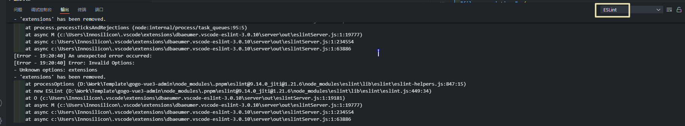

[ESLint 入门 - ESLint - 可插拔的 JavaScript 代码检查器 中文](https://eslint.org.cn/docs/latest/use/getting-started)

## 踩坑记录

### ESLint 插件无法提示代码中的错误

发现问题：在新创建的 Vue 3 项目中，我发现使用 `npm run lint` 会有很多报错，但是 VSCode 确没有提示错误。刚开始以为是 ESLint 版本原因，因为新版本用的是 V9 版本。后来发现，可以在**控制台 - 输出**中，选择 ESLint，查看其报错信息。可以看到，是 ESLint 插件的配置项 `eslint.options.extensions` 这个配置项在新版本已被废弃导致的（应使用 `eslint.probe`）。



询问 `o1-preview`，它推荐我应该将配置改为如下：

```JSON
{
  "eslint.probe": [
    "javascript",
    "javascriptreact",
    "typescript",
    "typescriptreact",
    "vue",
    "html",
    "json"
  ],
  "eslint.validate": [
    "javascript",
    "javascriptreact",
    "typescript",
    "typescriptreact",
    "vue"
  ],
}
```
