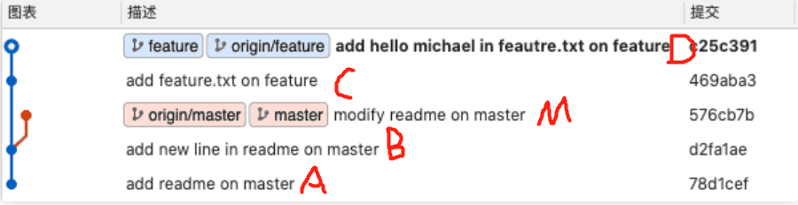
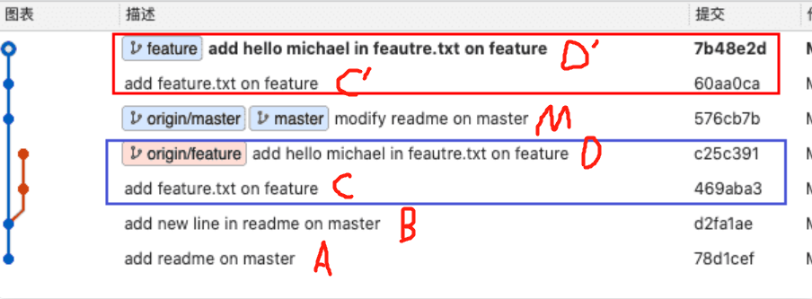

# (1 条消息) git rebase 详解（图解 + 最简单示例，一次就懂）_ 风中一匹狼 v 的博客 -CSDN 博客 _git rebase

> ## Excerpt
> 在拉公共分支最新代码的时候使用 rebase，也就是 git pull -r 但往公共分支上合代码的时候，使用 merge

---

## 引言

网上有太多讲 [rebase](https://so.csdn.net/so/search?q=rebase&spm=1001.2101.3001.7020) 和 merge 的文章，但大多都是复制粘贴没有自己的理解，而且很多博客的例子写的过于复杂，让人没兴趣看下去。本文举最简洁的例子，大白话几句就让你快速掌握 rebase 的核心原理和用法。

**本博客将持续修订更新，看完如果还是有疑问，可以评论区留言，我解释到你彻底搞懂为止！**

___

## 一、提交节点图解

首先通过简单的提交节点图解感受一下 rebase 在干什么

两个分支 master 和 feature，其中 feature 是在提交点 B 处从 master 上拉出的分支

master 上有一个新提交 M，feature 上有两个新提交 C 和 D

此时切换到 feature 分支上，执行如下命令，相当于是想要把 master 分支合并到 feature 分支（这一步的场景就可以类比为我们在自己的分支 feature 上开发了一段时间了，准备从主干 master 上拉一下最新改动）

```
git checkout feature
git rebase master

//这两条命令等价于git rebase master feature
```

下图为变基后的提交节点图，解释一下其工作原理：


- feature：待变基分支、当前分支
- master：基分支、目标分支

_官方解释_（如果觉得看不懂可以直接看下一段）：当执行 rebase 操作时，git 会从两个分支的共同祖先开始提取待变基分支上的修改，然后将待变基分支指向基分支的最新提交，最后将刚才提取的修改应用到基分支的最新提交的后面。

_结合例子解释_：当在 feature 分支上执行 git rebase master 时，git 会从 master 和 featuer 的共同祖先 B 开始提取 feature 分支上的修改，也就是 C 和 D 两个提交，先提取到。然后将 feature 分支指向 master 分支的最新提交上，也就是 M。最后把提取的 C 和 D 接到 M 后面，但这个过程是删除原来的 C 和 D，生成新的 C’和 D’，他们的提交内容一样，但 commit id 不同。feature 自然最后也是指向 D’。

**通俗解释（重要！！）**：rebase，变基，可以直接理解为改变基底。feature 分支是基于 master 分支的 B 拉出来的分支，feature 的基底是 B。而 master 在 B 之后有新的提交，就相当于此时要用 master 上新的提交来作为 feature 分支的新基底。实际操作为把 B 之后 feature 的提交存下来，然后删掉原来这些提交，再找到 master 的最新提交位置，把存下来的提交再接上去（新节点新 commit id），如此 feature 分支的基底就相当于变成了 M 而不是原来的 B 了。（注意，如果 master 上在 B 以后没有新提交，那么就还是用原来的 B 作为基，rebase 操作相当于无效，此时和 git merge 就基本没区别了，差异只在于 git merge 会多一条记录 Merge 操作的提交记录）

**上面的例子可抽象为如下实际工作场景：张三从 B 拉了代码进行开发，目前提交了两次，开发到 D 了；李四也从 B 拉出来开发了并且开发完毕，他提交到了 M，然后合到主干上了。此时张三想拉下最新代码，于是他在 feature 分支上执行了 git rebase master，即把 master 分支给 rebase 过来，由于李四更早开发完并合了主干，如此就相当于张三是基于李四的最新提交 M 进行的开发了。**

___

## 二、实际 git 提交示例

按照上面的图解构造了提交记录，如下图所示：（ABM 是 master 分支线，ABCD 是 feature 分支线。这里画成了 master 变色分叉出来，这不影响理解，知道是表示两个分支两条线即可！）

此时，在 feature 分支上执行 git rebase master

变基完成以后，ABCD 是原来的 feature 分支线，ABMC’D’是新的 feature 分支线，ABM 是 master 分支线（没有变化）


___

## 三、推荐使用场景

搞来搞去那么多，这其实是最重要的。不同公司，不同情况有不同使用场景，不过大部分情况推荐如下：

1. **自己单机的时候**，拉公共分支最新代码的时候使用 rebase，也就是 git pull -r 或 git pull --rebase。这样的好处很明显，提交记录会比较简洁。但有个缺点就是 rebase 以后我就不知道我的当前分支最早是从哪个分支拉出来的了，因为基底变了嘛，所以看个人需求了。
2. 往公共分支上合代码的时候，使用 merge。如果使用 rebase，那么其他开发人员想看主分支的历史，就不是原来的历史了，历史已经被你篡改了。举个例子解释下，比如张三和李四从共同的节点拉出来开发，张三先开发完提交了两次然后 merge 上去了，李四后来开发完如果 rebase 上去（注意李四需要切换到自己本地的主分支，假设先 pull 了张三的最新改动下来，然后执行<git rebase 李四的开发分支>，然后再 git push 到远端），则李四的新提交变成了张三的新提交的新基底，本来李四的提交是最新的，结果最新的提交显示反而是张三的，就乱套了。
3. **正因如此，大部分公司其实会禁用 rebase，不管是拉代码还是 push 代码统一都使用 merge，虽然会多出无意义的一条提交记录“Merge … to …”，但至少能清楚地知道主线上谁合了的代码以及他们合代码的时间先后顺序**

___

## 四、总结

无论是个人开发，还是公司协作开发，只要没有特殊需求，用 merge 准没错！！

参考文章：[图解 Git 基本命令 merge 和 rebase](https://www.cnblogs.com/michael-xiang/p/13179837.html)
