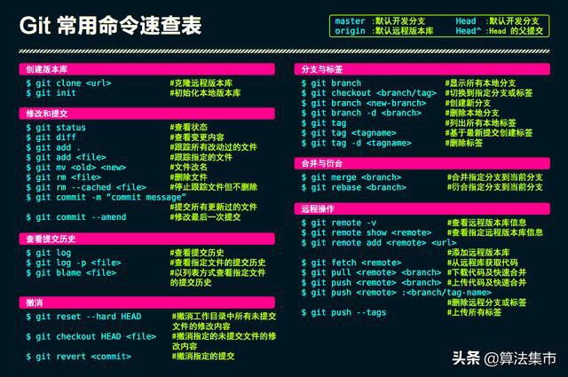

git commit --amend 修改上次提交，使用该命令后，可以修改上次提交的信息，如果暂存区有文件，会将这些文件包含到上次提交中。使用 -a 选项，可以将未添加到暂存区的文件也包含进上次提交中

git rebase

## git rebase 变基

%20git%20rebase详解（图解+最简单示例，一次就懂）_风中一匹狼v的博客-CSDN博客_git%20rebase.md)

## git cherry-pick 拣选

>[!warning] 注意
>cherry-pick 很容易造成问题。但是如果你的两个分支是两个单独的分支，永远不会相互 merge，那么就可以使用 cherry-pick
>
>参考：[经验：停止 cherry-pick，请开始 merge！-阿里云开发者社区 (aliyun.com)](https://developer.aliyun.com/article/886613)

## Fork 派生

>派生不是 git 的命令，而是 github 等服务商提供的功能

[派生](https://git-scm.com/book/zh/v2/GitHub-%E5%AF%B9%E9%A1%B9%E7%9B%AE%E5%81%9A%E5%87%BA%E8%B4%A1%E7%8C%AE#:~:text=GitHub%20%E6%B5%81%E7%A8%8B%201%20%E6%B4%BE%E7%94%9F%E4%B8%80%E4%B8%AA%E9%A1%B9%E7%9B%AE%202%20%E4%BB%8E%20master%20%E5%88%86%E6%94%AF%E5%88%9B%E5%BB%BA%E4%B8%80%E4%B8%AA%E6%96%B0%E5%88%86%E6%94%AF,6%20%E8%AE%A8%E8%AE%BA%EF%BC%8C%E6%A0%B9%E6%8D%AE%E5%AE%9E%E9%99%85%E6%83%85%E5%86%B5%E7%BB%A7%E7%BB%AD%E4%BF%AE%E6%94%B9%207%20%E9%A1%B9%E7%9B%AE%E7%9A%84%E6%8B%A5%E6%9C%89%E8%80%85%E5%90%88%E5%B9%B6%E6%88%96%E5%85%B3%E9%97%AD%E4%BD%A0%E7%9A%84%E6%8B%89%E5%8F%96%E8%AF%B7%E6%B1%82%208%20%E5%B0%86%E6%9B%B4%E6%96%B0%E5%90%8E%E7%9A%84%20master%20%E5%88%86%E6%94%AF%E5%90%8C%E6%AD%A5%E5%88%B0%E4%BD%A0%E7%9A%84%E6%B4%BE%E7%94%9F%E4%B8%AD)
