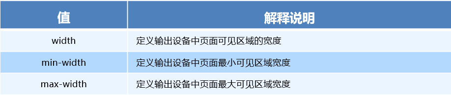
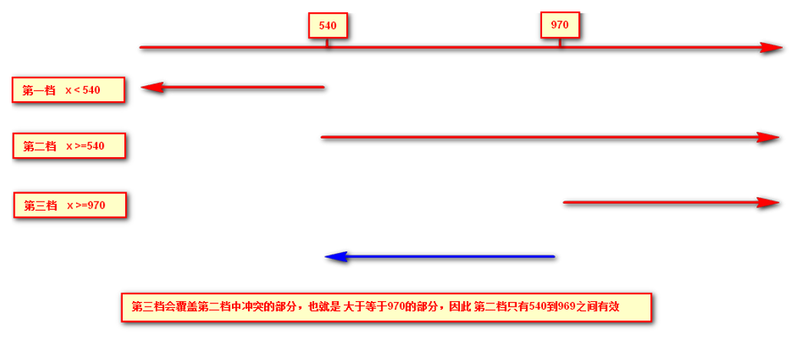

# 移动 web 开发之 rem 布局

### rem 基础

#### rem 单位

rem (root em) 是一个相对单位，类似于 em，em 是父元素字体大小。

不同的是**rem 的基准是相对于 html 元素的字体大小。**

比如，根元素（html）设置 font-size=12px; 非根元素设置 width:2rem; 则换成 px 表示就是 24px。

```
/* 根html 为 12px */
html {
   font-size: 12px;
}
/* 此时 div 的字体大小就是 24px */       
div {
    font-size: 2rem;
}
```

rem 的优势：父元素文字大小可能不一致，但是整个页面只有一个 html，可以很好来控制整个页面的元素大小。

### 媒体查询

#### 什么是媒体查询

媒体查询（Media Query）是 CSS3 新语法。

+ 使用 @media 查询，可以针对不同的媒体类型定义不同的样式
+ @media 可以针对不同的屏幕尺寸设置不同的样式
+ 当你重置浏览器大小的过程中，页面也会根据浏览器的宽度和高度重新渲染页面
+ 目前针对很多苹果手机、Android 手机，平板等设备都用得到多媒体查询

#### 媒体查询语法规范

+ 用 @media 开头 注意@符号
+ mediatype 媒体类型
+ 关键字 and  not  only
+ media feature 媒体特性必须有小括号包含

```
@media mediatype and|not|only (media feature) {
    CSS-Code;
}
```

1. mediatype 查询类型

​       将不同的终端设备划分成不同的类型，称为媒体类型

| 值     | 解释说明             |
| ------ | -------------------- |
| all    | 用于所有设备         |
| print  | 用于打印机和打印预览 |
| screen | 用于电脑屏幕，平板电脑，智能手机等                     |

1. 关键字

​       关键字将媒体类型或多个媒体特性连接到一起做为媒体查询的条件。

+ and：可以将多个媒体特性连接到一起，相当于“且”的意思。
+ not：排除某个媒体类型，相当于“非”的意思，可以省略。
+ only：指定某个特定的媒体类型，可以省略。

1. 媒体特性

   每种媒体类型都具体各自不同的特性，根据不同媒体类型的媒体特性设置不同的展示风格。我们暂且了解三个。

   注意他们要加小括号包含

   

2. 媒体查询书写规则

   注意：为了防止混乱，媒体查询我们要按照从小到大或者从大到小的顺序来写,但是我们最喜欢的还是从小到大来写，这样代码更简洁

   

   也可以设置范围：

   ```css
   @media screen and (min-width:450px) and (max-width:500px) {
       body {
           background: -webkit-linear-gradient(left, red, blue);
       }
   }
   ```

### less 基础

#### 维护 css 弊端

CSS 是一门非程序式语言，没有变量、函数、SCOPE（作用域）等概念。

+ CSS 需要书写大量看似没有逻辑的代码，CSS 冗余度是比较高的。
+ 不方便维护及扩展，不利于复用。
+ CSS 没有很好的计算能力
+ 非前端开发工程师来讲，往往会因为缺少 CSS 编写经验而很难写出组织良好且易于维护的 CSS 代码项目。

#### Less 介绍

Less（LeanerStyle Sheets 的缩写）是一门 CSS 扩展语言，也成为 CSS 预处理器。

做为 CSS 的一种形式的扩展，它并没有减少 CSS 的功能，而是在现有的 CSS 语法上，为 CSS 加入程序式语言的特性。

它在 CSS 的语法基础之上，引入了变量，Mixin（混入），运算以及函数等功能，大大简化了 CSS 的编写，并且降低了 CSS 的维护成本，就像它的名称所说的那样，Less 可以让我们用更少的代码做更多的事情。

Less 中文网址：[http://](http://lesscss.cn/)[less](http://lesscss.cn/)[css.cn/](http://lesscss.cn/)

常见的 CSS 预处理器：Sass、Less、Stylus

一句话：Less 是一门 CSS 预处理语言，它扩展了 CSS 的动态特性。

**Less 安装**

+ 方法 1：

①安装 nodejs，可选择版本 (8.0)，网址：<http://nodejs.cn/download/>

②检查是否安装成功，使用 cmd 命令（win10 是 window+r 打开运行输入 cmd）--- 输入“node–v”查看版本即可

③基于 nodejs 在线安装 Less，使用 cmd 命令“npm install -g less”即可

④检查是否安装成功，使用 cmd 命令“ lessc -v ”查看版本即可

+ 方法 2：**Less 编译 vocode Less 插件**

**安装 Easy LESS 插件** 用来把 less 文件编译为 css 文件

安装完毕插件，重新加载下 vscode。

只要保存一下 Less 文件，会自动生成 CSS 文件。


**Less 使用之变量**

变量是指没有固定的值，可以改变的。因为我们 CSS 中的一些颜色和数值等经常使用。

```
@变量名:值;
```

+ 必须有@为前缀
+ 不能包含特殊字符
+ 不能以数字开头
+ 大小写敏感

```
@color: pink;
```

Less 嵌套

```less
// 将css改为less
#header .logo {
  width: 300px;
}

#header {
    .logo {
       width: 300px;
    }
}

```

如果遇见（交集|伪类|伪元素选择器），利用&进行连接

```less
a:hover{
    color:red;
}
a{
  &:hover{
      color:red;
  }
}
```

Less 运算

任何数字、颜色或者变量都可以参与运算。就是 Less 提供了加（+）、减（-）、乘（*）、除（/）算术运算。

```
/*Less 里面写*/
@witdh: 10px + 5;
div {
    border: @witdh solid red;
}
/*生成的css*/
div {
  border: 15px solid red;
}
/*Less 甚至还可以这样 */
width: (@width + 5) * 2;

```

+ 乘号（*）和除号（/）的写法
  + **注意：除法要用括号括起来**
+ 运算符中间左右有个空格隔开 1px + 5
+ 对于两个不同的单位的值之间的运算，运算结果的值取第一个值的单位
+ 如果两个值之间只有一个值有单位，则运算结果就取该单位

#### 在 HTML 中直接引用 less(知道即可)

1. 修改 rel 加入 less

   ```html
   < link rel=" stylesheet/less" href="./my.1ess"
   ```

2. 引入一个编译 less 的 js
3. 通过 live server

#### 导入其他 less 文件

```less
@import 'base.less';
```

#### 注释

```less
//注释只能保存在less文件里，不会保存在css文件里

/*注释可以保存到css文件中，快捷键 Shift + alt + A */  
```

#### 混入 (函数)

**1. 不带参数**

```less
//声明函数
.br {
    -moz-border-radius: 40%;
    -webkit-border-radius: 40%;
    -ms-border-radius: 40%;
    -o-border-radius: 40%;
    border-radius: 40%;
}
//调用函数
.box {
    .br()
}
```

**2. 带参数**

```less
//声明函数 @deg为变量
.br(@deg) {
    -moz-border-radius: @deg;
    -webkit-border-radius: @deg;
    -ms-border-radius: @deg;
    -o-border-radius: @deg;
    border-radius: @deg;
}
//调用函数 ，并使用参数
.box {
    .br(40%)
}
```

**3. 带默认值的参数**

```less
//声明函数 @deg为变量,如果在调用时不使用参数，则会使用默认值（40%）
.br(@deg:40%) {
    -moz-border-radius: @deg;
    -webkit-border-radius: @deg;
    -ms-border-radius: @deg;
    -o-border-radius: @deg;
    border-radius: @deg;
}
//调用函数
.box {
    //这里不加参数，会使用默认值 40%
    .br()
}
```

### rem 适配方案

1.让一些不能等比自适应的元素，达到当设备尺寸发生改变的时候，等比例适配当前设备。

2.使用媒体查询根据不同设备按比例设置 html 的字体大小，然后页面元素使用 rem 做尺寸单位，当 html 字体大小变化元素尺寸也会发生变化，从而达到等比缩放的适配。

**技术方案：**

**1.less+rem+ 媒体查询**

**2.flexible.js+rem(推荐)**

总结：

两种方案现在都存在。

方案 2 更简单，现阶段大家无需了解里面的 js 代码。

#### rem 实际开发适配方案 1

①假设设计稿是 750px

②假设我们把整个屏幕划分为 15 等份（划分标准不一可以是 20 份也可以是 10 等份）

③每一份作为 html 字体大小，这里就是 50px

④那么在 320px 设备的时候，字体大小为 320/15 就是 21.33px

⑤用我们页面元素的大小除以不同的 html 字体大小会发现他们比例还是相同的

⑥比如我们以 750 为标准设计稿

⑦一个 100*100 像素的页面元素在 750 屏幕下，就是 100/ 50 转换为 rem 是 2rem*2rem 比例是 1 比 1

⑧320 屏幕下，html 字体大小为 21.33 则 2rem=  42.66px 此时宽和高都是 42.66 但是宽和高的比例还是 1 比 1

⑨但是已经能实现不同屏幕下  页面元素盒子等比例缩放的效果

总结：

①最后的公式：页面元素的 rem 值 =  页面元素值（px）/（屏幕宽度  /  划分的份数）

②屏幕宽度/划分的份数就是 htmlfont-size 的大小

③或者：页面元素的 rem 值 =  页面元素值（px）/  html font-size 字体大小

### 苏宁首页

苏宁首页地址：[苏宁首页](https://m.suning.com)

1、技术选型

方案：我们采取单独制作移动页面方案

技术：布局采取 rem 适配布局（less + rem  + 媒体查询）

设计图：本设计图采用 750px 设计尺寸

2、搭建文件结构


3、设置视口标签以及引入初始化样式

```
<meta name="viewport" content="width=device-width, user-scalable=no,         initial-scale=1.0, maximum-scale=1.0, minimum-scale=1.0">

<link rel="stylesheet" href="css/normalize.css">
```

4、设置公共 common.less 文件

+ 新建 common.less 设置好最常见的屏幕尺寸，利用媒体查询设置不同的 html 字体大小，因为除了首页其他页面也需要
+ 我们关心的尺寸有 320px、360px、375px、384px、400px、414px、424px、480px、540px、720px、750px
+ 划分的份数我们定为 15 等份
+ 因为我们 pc 端也可以打开我们苏宁移动端首页，我们默认 html 字体大小为 50px，注意这句话写到最上面

### rem 适配方案 2

手机淘宝团队出的简洁高效 移动端适配库

我们再也不需要在写不同屏幕的媒体查询，因为里面 js 做了处理

它的原理是把当前设备划分为 10 等份，但是不同设备下，比例还是一致的。

我们要做的，就是确定好我们当前设备的 html 文字大小就可以了

比如当前设计稿是 750px，那么我们只需要把 html 文字大小设置为 75px(750px / 10) 就可以

里面页面元素 rem 值：页面元素的 px 值 /  75

剩余的，让 flexible.js 来去算

github 地址：[https://github.com/amfe/lib-flexible](https://link.jianshu.com/?t=https://github.com/amfe/lib-flexible)

总结：

因为 flexible 是默认将屏幕分为 10 等分

但是当屏幕大于 750 的时候希望不要再去重置 html 字体了

所以要自己通过媒体查询设置一下

并且要把权重提到最高

VSCode  px 转换 rem 插件 cssrem

因为 cssrem 中 css 自动转化为 rem 是参照默认插件的 16 转换的所以需要自己配置


