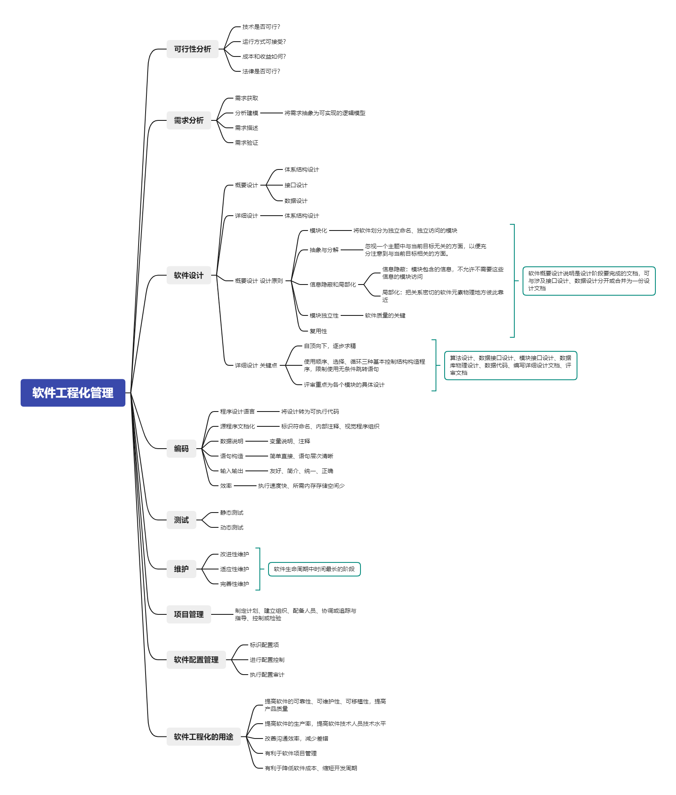

## 软件危机

由于忽视软件开发前期的调研和需求分析工作、确认经验等原因。软件开发往往面临着不能满足用户需求、成本超标、开发周期超时等等危机

## 软件的生命周期

软件工程的目的是在经费预算范围内，按期交付出用户满意的、质量合格的软件产品

软件的生命周期包含：计划时期（问题定义、可行性研究）、开发时期、运行时期三个阶段，开发时期又可包含：需求分析、详细设计、编码、测试这些阶段

## 软件开发模型

瀑布模型、快速原型模型、渐增模型、喷泉模型、螺旋模型

## 软件工具

包括软件开发、维护、管理方面的工具

## 软件工程化管理

[软件工程化管理.xmind](assets/软件工程化管理.xmind)

