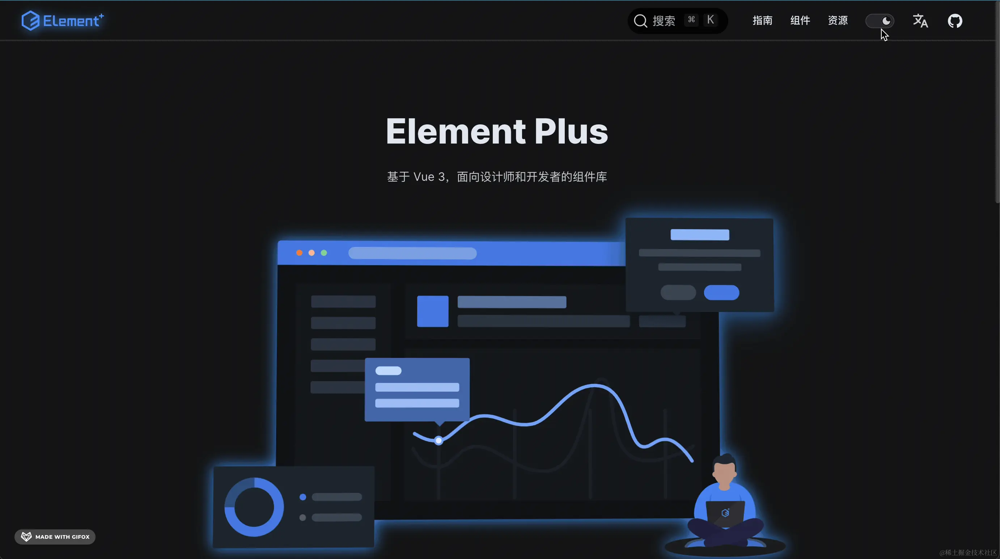
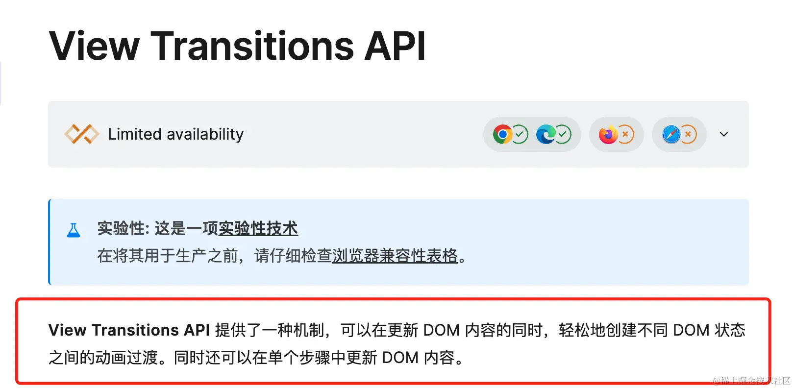
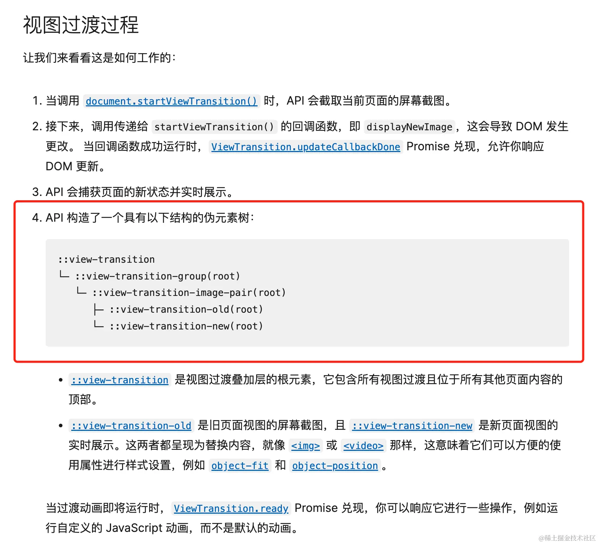
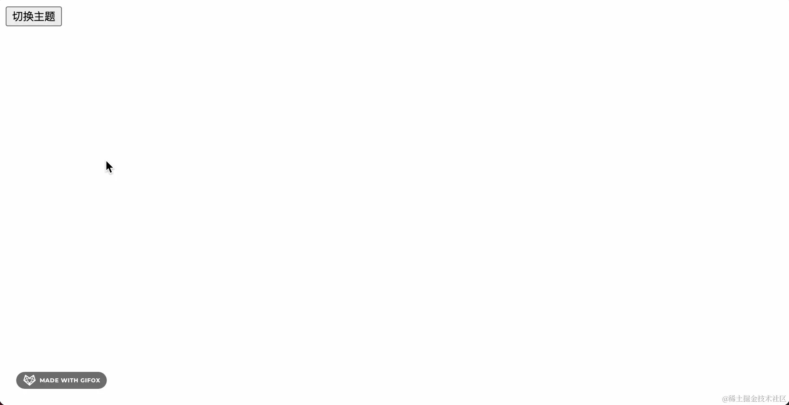
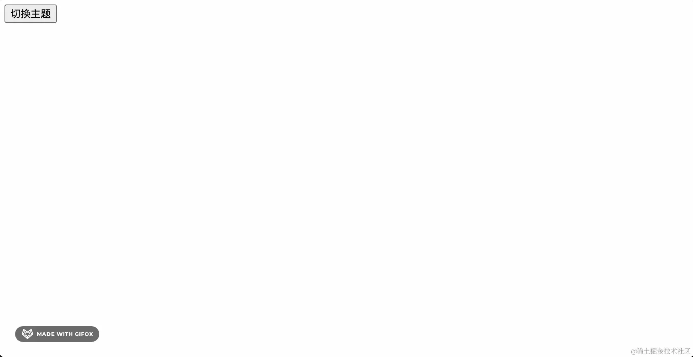
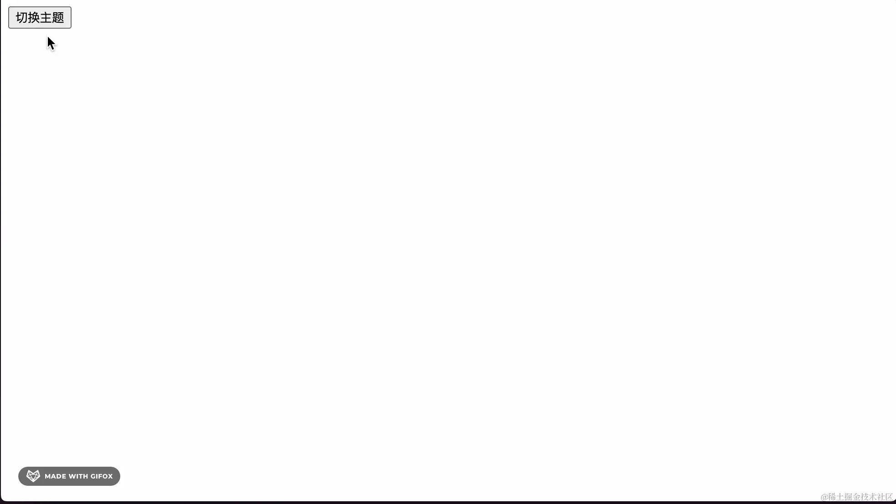
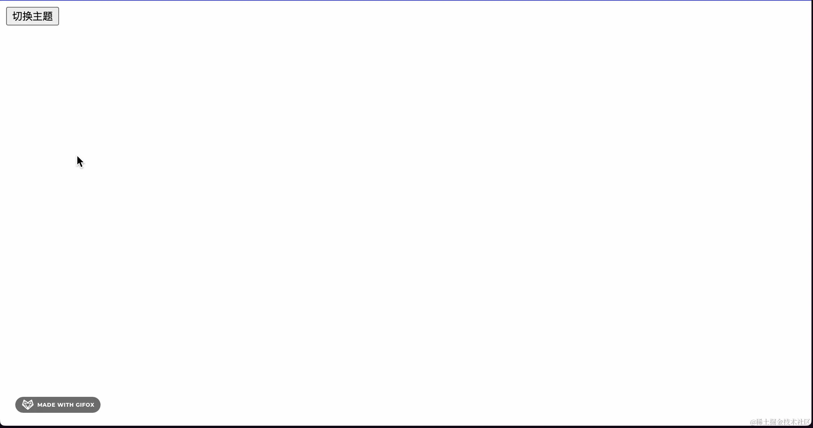

> 本文来源：[element-plus 主题切换动画 | Meet you](https://blog.wjp.plus/article/element-plus-theme.html)

## 前言

前些天看到 [element-plus](https://element-plus.org/zh-CN/) 官网的主题切换动画做的特别炫酷，私下研究了一下，今天我们一起来看一下它的实现思路，废话不多说，先上图：



在这里我们看到，有一个圆形扩散的效果，非常的炫酷，这种效果要怎么实现呢，在实现之前，我们先来看一个新型的 API，它就是 [View Transitions API](https://developer.mozilla.org/zh-CN/docs/Web/API/View_Transitions_API)，我们这个过渡效果，就是利用它实现的。

## [View Transitions API](https://developer.mozilla.org/zh-CN/docs/Web/API/View_Transitions_API) 介绍 [](https://blog.wjp.plus/article/element-plus-theme.html#view-transitions-api-%E4%BB%8B%E7%BB%8D)



在介绍中看到，[View Transitions API](https://developer.mozilla.org/zh-CN/docs/Web/API/View_Transitions_API) 可以在更新 DOM 内容的同时，创建不同 DOM 状态之间的过渡动画，利用这一点，我们来实现主题切换的过渡动画。

在实现之前，我们还需要了解一下这个 API 的另一个特性，那就是当我们在使用这个 API 产生动画的时候，它会帮我们对整个页面进行截图操作，同样我们也可以拿到这个截图，我们来看一下：



这个 API 会帮我们创造一组伪元素，在这组伪元素中，我们可以拿到页面状态变化产生的新页面截图 `::view-transition-new(root)` 和旧页面的截图 `::view-transition-old(root)`，我们利用这组截图，来实现我们想要的效果。

## 实现 [](https://blog.wjp.plus/article/element-plus-theme.html#%E5%AE%9E%E7%8E%B0)

我们先来创建一个主题切换功能的页面

```html
<!DOCTYPE html>
<html lang="en">
  <head>
    <meta charset="UTF-8" />
    <meta name="viewport" content="width=device-width, initial-scale=1.0" />
    <title>主题切换</title>
    <style>
      :root {
        /* 亮色模式下的背景色 */
        --bg-color: #fff;
        background-color: var(--bg-color);
      }
      :root.dark {
        /* 暗色模式下的背景色 */
        --bg-color: #000;
      }
    </style>
  </head>
  <body>
    <button id="btn">切换主题</button>
    <script>
      const btn = document.getElementById('btn')
      btn.addEventListener('click', () => {
        // 点击按钮时切换主题
        document.documentElement.classList.toggle('dark')
      })
    </script>
  </body>
</html>
```

我们来看一下效果：



目前我们实现了主题切换的功能，但是没有过渡效果，如果我们要使用 [View Transitions API](https://developer.mozilla.org/zh-CN/docs/Web/API/View_Transitions_API) 实现过渡效果，我们需要调用 [`document.startViewTransition()`](https://developer.mozilla.org/zh-CN/docs/Web/API/Document/startViewTransition)，在我们调用它的时候，会产生动画，我们来完成一下代码：

```js
const btn = document.getElementById('btn');
btn.addEventListener('click', () => {
  // 点击按钮时切换主题
  document.startViewTransition(() => {
  // 在 startViewTransition 中修改 DOM 状态产生动画
    document.documentElement.classList.toggle('dark');
  });
});
```

效果图：



我们在 [`document.startViewTransition()`](https://developer.mozilla.org/zh-CN/docs/Web/API/Document/startViewTransition) 中切换主题，此时我们可以看到，有一个淡入淡出的效果，但是这并不是我们想要的，我们要实现 element-plus 中的圆形扩散效果，我们还需要用到 `::view-transition-new(root)` 和 `::view-transition-old(root)` 这两个伪元素，这两个伪元素是屏幕截图，那么我们怎样利用它产生一个截图的效果呢，这里我们引入一个 css 属性 [`clip-path`](https://developer.mozilla.org/zh-CN/docs/Web/CSS/clip-path)，我们可以通过 [`clip-path`](https://developer.mozilla.org/zh-CN/docs/Web/CSS/clip-path) 属性将一个元素裁剪成任意形状，在这个效果中，我们需要将 `::view-transition` 进行一个圆形的裁剪，用于实现圆形的过渡效果，如果需要过渡，那么就是将这个圆的半径从 0 过渡到 100%，这样就会有过渡的效果，下面我们来实现一下它：

```js
const btn = document.getElementById('btn');
// 点击按钮时切换主题
btn.addEventListener('click', (e) => {
  // 获取到 transition API 实例
  const transition = document.startViewTransition(() => {
    document.documentElement.classList.toggle('dark');
  });

  // 在 transition.ready 的 Promise 完成后，执行自定义动画
  transition.ready.then(() => {
    // 由于我们要从鼠标点击的位置开始做动画，所以我们需要先获取到鼠标的位置
    const { clientX, clientY } = e;

    // 计算半径，以鼠标点击的位置为圆心，到四个角的距离中最大的那个作为半径
    const radius = Math.hypot(
      Math.max(clientX, innerWidth - clientX),
      Math.max(clientY, innerHeight - clientY)
    );

    // 自定义动画
    document.documentElement.animate(
      {
        clipPath: [
          `circle(0% at ${clientX}px ${clientY}px)`,
          `circle(${radius}px at ${clientX}px ${clientY}px)`
        ]
      },
      {
        duration: 500,
        pseudoElement: '::view-transition-new(root)'
      }
    );
  });
});
```

我们同时还需要禁用默认的淡入淡出动画，否则将影响我们自定义的动画效果

```css
::view-transition-new(root),
::view-transition-old(root) {
/* 关闭默认动画，否则影响自定义动画的执行 */
   animation: none;
}
```

通过以上代码，我们已经实现了主题切换的自定义动画，我们来看一下效果：



- 最终实现

到目前为止，我们已经实现了主题切换的圆形扩散动画，但是在 element-plus 官网的动画中，从浅色切换到暗色是一个圆形收起的效果，这样的话我们就要将 clipPath 的半径从 100% 过渡到 0，这样就可以实现圆形收起的效果，我们来实现一下它：

```js
const btn = document.getElementById('btn');
// 点击按钮时切换主题
btn.addEventListener('click', (e) => {
  // 获取到 transition API 实例
  const transition = document.startViewTransition(() => {
    document.documentElement.classList.toggle('dark');
  });

  // 在 transition.ready 的 Promise 完成后，执行自定义动画
  transition.ready.then(() => {
    // 由于我们要从鼠标点击的位置开始做动画，所以我们需要先获取到鼠标的位置
    const { clientX, clientY } = e;

    // 计算半径，以鼠标点击的位置为圆心，到四个角的距离中最大的那个作为半径
    const radius = Math.hypot(
      Math.max(clientX, innerWidth - clientX),
      Math.max(clientY, innerHeight - clientY)
    );
    const clipPath = [
      `circle(0% at ${clientX}px ${clientY}px)`,
      `circle(${radius}px at ${clientX}px ${clientY}px)`
    ];
    const isDark = document.documentElement.classList.contains('dark');
    // 自定义动画
    document.documentElement.animate(
      {
        // 如果要切换到暗色主题，我们在过渡的时候从半径 100% 的圆开始，到 0% 的圆结束
        clipPath: isDark ? clipPath.reverse() : clipPath
      },
      {
        duration: 500,
        // 如果要切换到暗色主题，我们应该裁剪 view-transition-old(root) 的内容
        pseudoElement: isDark
          ? '::view-transition-old(root)'
          : '::view-transition-new(root)'
      }
    );
  });
});
```

因为层级原因，我们需要调整过渡到暗色模式时 `::view-transition-old(root)` 的层级

```css
.dark::view-transition-old(root) {
  z-index: 100;
}
```

来看我们最终实现的效果：



到此我们就实现了主题切换的过渡动画

本文视频讲解已同步到 b 站：[https://space.bilibili.com/423876881?spm\_id\_from=333.1007.0.0](https://space.bilibili.com/423876881?spm_id_from=333.1007.0.0)

作者：远方 os

链接：[https://juejin.cn/post/7361721559239524390](https://juejin.cn/post/7361721559239524390)

来源：稀土掘金
