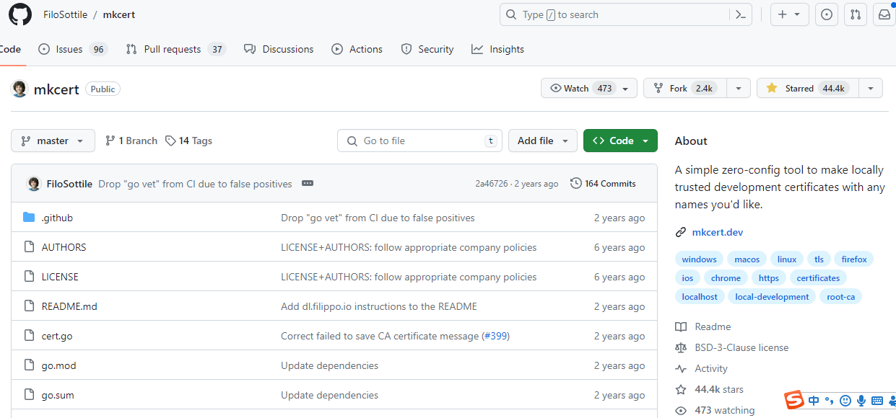
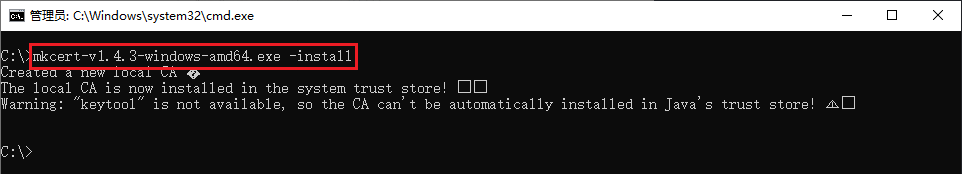

# 使用 `mkcert` 在开发环境启用 HTTPS

>本文来源：[mkcert的安装和使用，5分学会在本地开启localhost的https访问方式-CSDN博客](https://blog.csdn.net/weixin_44786530/article/details/135893188)，稍作修改

mkcert 官方仓库地址：[https://github.com/FiloSottile/mkcert#installation](https://github.com/FiloSottile/mkcert#installation "https://github.com/FiloSottile/mkcert#installation")

mkcert 是一个简单的工具，用于制作本地信任的开发证书。它不需要配置。

简化我们在本地搭建 https 环境的复杂性，无需操作繁杂的 openssl 实现自签证书了，这个 小程序 就可以帮助我们自签证书，在本机使用还会自动信任 CA，非常方便。

使用来自真实 [证书颁发机构](https://so.csdn.net/so/search?q=%E8%AF%81%E4%B9%A6%E9%A2%81%E5%8F%91%E6%9C%BA%E6%9E%84&spm=1001.2101.3001.7020) (CA) 的证书进行开发可能很危险或不可能（对于 example.test、localhost 或 之类的主机 127.0.0.1），但自签名证书会导致信任错误。管理您自己的 CA 是最好的解决方案，但通常涉及神秘的命令、专业知识和手动步骤。

mkcert 在系统根存储中自动创建并安装本地 CA，并生成本地信任的证书。mkcert 不会 [自动配置](https://so.csdn.net/so/search?q=%E8%87%AA%E5%8A%A8%E9%85%8D%E7%BD%AE&spm=1001.2101.3001.7020) 服务器以使用证书，但这取决于您。

## 下载

我使用 Windows 10 操作系统进行演示说明。mkcert 也支持其他平台的安装与使用，自行下载对应的版本安装即可，下载地址：

windows 大部分都是 amd 架构：[https://github.com/FiloSottile/mkcert/releases](https://github.com/FiloSottile/mkcert/releases "https://github.com/FiloSottile/mkcert/releases")


## 安装

安装 mkcert。

使用以下命令，就能帮助我们将 mkcert 使用的根证书加入了本地可信 CA 中，以后由该 CA 签发的证书在本地都是可信的。下载后到下载目录中安装：

> [!tip]
> 在命令行中使用以下命令，而不是双击 `exe` 文件

```cobol
mkcert-v1.4.4-windows-amd64.exe -install
```

 会提示你，点击是即可：


安装成功成功。提示创建一个新的本地 CA，本地 CA 现在已安装在系统信任存储中。 



## 查看根证书位置

如果你想查看根证书位置，可以输入命令：

```cobol
mkcert-v1.4.4-windows-amd64.exe -CAROOT
```


 或者到我的电脑信任证书中查看也是可以的，按“Windows 键 +R”调出运行框，输入 certmgr.msc 命令。打开证书控制台：


在受信任的证书颁发机构中可以看到： 


## 生成自签证书

直接跟多个要签发的域名或 ip 就行了，比如签发一个仅本机访问的证书 (可以通过 127.0.0.1 和 localhost，以及 ipv6 `::1` 地址访问)：

```cobol
mkcert-v1.4.4-windows-amd64.exe localhost 127.0.0.1 ::1 192.168.2.25
```

需要在局域网内测试 https 应用，这种环境可能不对外，因此也无法使用像 Let's encrypt 这种免费证书的方案给局域网签发一个可信的证书，而且 Let's encrypt 本身也不支持认证 Ip。

证书可信的三个要素:

1. 由可信的 CA 机构签发。
2. 访问的地址跟证书认证地址相符。
3. 证书在有效期内。如果期望自签证书在局域网内使用，以上三个条件都需要满足。很明显自签证书一定可以满足证书在有效期内，那么需要保证后两条。我们签发的证书必须匹配浏览器的地址栏，比如局域网的 ip 或者域名，此外还需要信任 CA。

在 mkcert 软件同目录下，生成了自签证书。如图所示：


> 通过输出，我们可以看到成功生成了 `localhost+3.pem` 证书文件和 `localhost+3-key.pem` 私钥文件，只要在 web server 上使用这两个文件就可以了。

## 前端项目配置证书

如果你是前端项目，可以在项目根目录下创建 certs 文件夹，将刚创建的证书添加进去，然后配置 webpack 或者 vite 的配置文件，然后重新启动项目就可以了：


配置文件代码： 

```javascript
export default defineConfig({
  plugins: [vue()],
  server: {
    host: '0.0.0.0',
    https: {
      key: fs.readFileSync('certs/127.0.0.1+1-key.pem'),
      cert: fs.readFileSync('certs/127.0.0.1+1.pem'),
    },
  },
  resolve: {
    alias: {
      '@': path.resolve(__dirname, 'src'),
    },
  },
});
```

 重新启动项目就可以看到是 https 了：但是因为只配置了 localhost，所以只能 localhost 使用 https 访问，其它的 ip 地址需要重新使用命令配置到你的证书里面才可以访问。


并且访问的时候浏览器也认可：


### 在 umi3 项目中配置

在 `config/config.ts` 文件中

```ts
// https://umijs.org/config/
import { defineConfig } from 'umi';
//...

const { NODE_ENV, REACT_APP_ENV } = process.env;

export default defineConfig({
  //...
  devServer: {
    https: { //
      key: './certs/localhost+2-key.pem',
      cert: './certs/localhost+2.pem',
    },
  },
});
```
