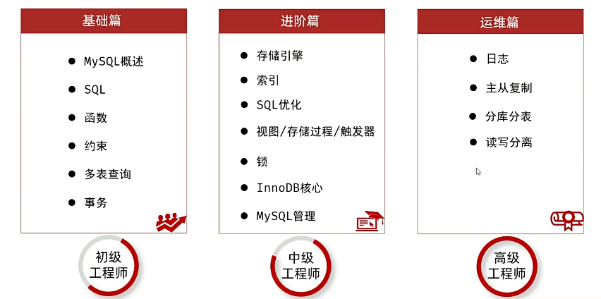

# MySQL

## 学习进度

https://www.bilibili.com/video/BV1Kr4y1i7ru



- [x] [基础篇](#基础篇) ★★
- [ ] [进阶篇](#进阶篇) ★★★
	- [ ] 学到了 [03. 进阶-存储引擎-简介_哔哩哔哩_bilibili](https://www.bilibili.com/video/BV1Kr4y1i7ru?spm_id_from=333.788.videopod.episodes&vd_source=ad8e06478fc114ff9485f641eabc0b4c&p=60)
- [ ] 运维 ★★★★

## 安装

### 安装到 Windows

下载：[MySQL :: Download MySQL Installer](https://dev.mysql.com/downloads/installer/)

选择需要的版本后，点击下载进入下载页面，点击下图链接直接下载


## 基础篇

### MySQL 概述


### SQL

#### SQL 通用语法


#### SQL 分类


##### DDL (数据定义语言)


 

###### 数据类型

可参考:  https://www.runoob.com/mysql/mysql-data-types.html


###### 表操作 - 添加、修改、删除


##### DML (数据操作语言）


**添加时，自增字段可以用 `NULL` 代替**


**未指定条件，则会删除整张表的所有数据**

##### DQL (数据查询语言)


###### DQL 的执行顺序


##### DCL (数据控制语言)


### 函数


### 约束


### 多表查询

#### 多表关系


#### 多表查询概述

`SELECT * FROM user,dept WHERE user.dept_id = dept.id;`


#### 内连接


示例：

```sql
# 隐式内连接
SELECT u.name 姓名,d.name 部门 FROM user u,dept d WHERE u.dept_id = d.id;

# 显式内连接
SELECT u.name 姓名,d.name 部门 FROM user u INNER JOIN dept d ON u.dept_id = d.id;
```

> 建议使用**显式内连接**

#### 外连接


> **常用左外连接**（右外连接可以改写为左外）

#### 自连接


#### 联合查询


#### 子查询


示例：


列子查询示例（ALL）：

列子查询示例 (SOME/ANY):


行子查询示例：

表子查询示例：


### 事务


#### 事务操作

##### 方式 1

>  `SELECT @@autocommit;` 查询当前会话的事务提交方式，`1` 为自动提交，设置为 `0` 为手动提交（仅在当前会话生效）

- 开启事务
```sql
SELECT @@autocommit;
SET @@autocommit = 0;
```

- 提交事务
```sql
COMMIT;
```

- 回滚事务
```sql
ROLLBACK;
```

##### 方式 2

- 开启事务
```sql
START TRANSACTION;
-- 或 
BEGIN;
```

- 提交事务
```sql
COMMIT;
```

- 回滚事务
```sql
ROLLBACK;
```

#### 事务四大特性 ACID


#### 并发事务问题


#### 事务隔离级别


**<font color="#ff0000">注意：事务隔离级别越高，数据越安全，但是性能越低</font>**

## 进阶篇

### MySQL 体系结构


#### 存储引擎

存储引擎就是存储数据、建立索引、更新/查询数据等技术的实现方式。存储引擎是基于表的，而不是基于库的，所以存储引擎也可被称为表类型。
